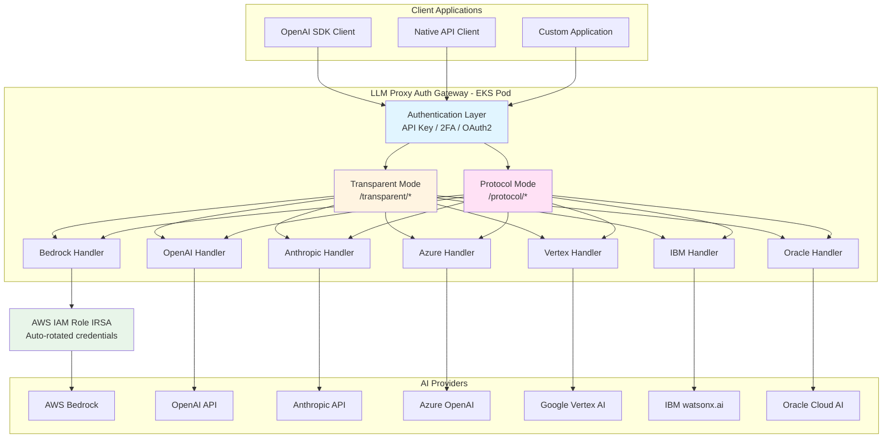
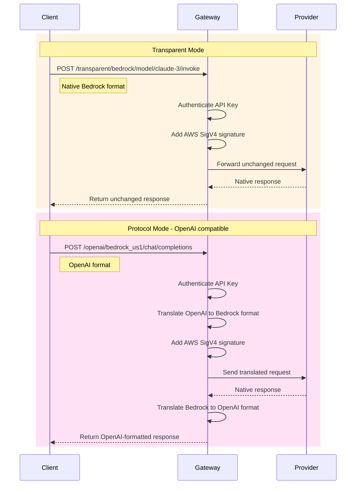
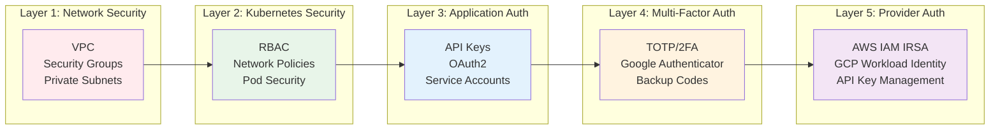

# LLM Proxy Auth

A secure, production-ready multi-provider AI Gateway with comprehensive authentication, supporting 7+ AI providers including AWS Bedrock, OpenAI, Anthropic, Azure, Google Vertex AI, IBM watsonx.ai, and Oracle Cloud AI.

Formerly known as Bedrock IAM Proxy.

## Features

### Core Features
- **Multi-Provider Support**: AWS Bedrock, OpenAI, Anthropic Claude, Azure OpenAI, Google Vertex AI, IBM watsonx.ai, Oracle Cloud AI
- **Dual-Mode Architecture**:
  - **Transparent Mode**: Authentication-only passthrough (preserves native APIs)
  - **Protocol Mode**: OpenAI-compatible API with request/response translation
- **Security-First Design**: Distroless container, non-root execution, comprehensive security scanning
- **OpenAI Compatibility**: Drop-in replacement for OpenAI SDK across all providers
- **Parameter Translation**: Comprehensive parameter mapping between provider formats
- **Region-Aware Routing**: Support for multi-region deployments (e.g., Bedrock US/EU)

### Authentication & Security
- **AWS Integration**: Native EKS IRSA support with fallback to EC2 instance profiles
- **Multiple Auth Methods**: API Key, Basic Auth, TOTP/2FA, Service Account, OAuth2
- **No Credentials Needed**: For AWS Bedrock using IAM roles (IRSA)
- **Secret Management**: Kubernetes Secrets, AWS Secrets Manager, HashiCorp Vault integration

### Operations & Observability
- **Observability**: Prometheus metrics per instance/provider/region, structured logging, health checks
- **Production-Ready**: Graceful shutdowns, proper error handling, comprehensive testing
- **Private VPC Support**: Designed for fully private EKS clusters with VPC endpoints
- **Configuration-Driven**: YAML-based instance configuration with environment variable expansion

## Architecture

### High-Level Architecture



### Dual-Mode Architecture

The gateway supports two operational modes:

**Transparent Mode** (`/transparent/{provider}`):
- Authentication-only passthrough
- Preserves native provider APIs
- Minimal transformation
- Best for provider-specific features

**Protocol Mode** (`/{protocol}/{instance}`):
- OpenAI-compatible API
- Request/response translation
- Multi-provider abstraction
- Best for standardization



## Quick Start

### Prerequisites

- Go 1.21+
- Docker with BuildKit
- AWS CLI configured
- kubectl access to EKS cluster

### Build

```bash
# Build the application
go build -v ./cmd/bedrock-proxy

# Run tests
go test ./...

# Build Docker image
docker build -f build/Dockerfile -t bedrock-proxy .
```

### Deploy

1. **Deploy Infrastructure**:
   ```bash
   cd deployments/terraform
   terraform init
   terraform plan
   terraform apply
   ```

2. **Deploy Application**:
   ```bash
   kubectl apply -f deployments/kubernetes/
   ```

3. **Verify Deployment**:
   ```bash
   kubectl get pods -n bedrock-system
   kubectl logs -f deployment/bedrock-proxy -n bedrock-system
   ```

## Configuration

### Environment Variables

| Variable | Description | Default |
|----------|-------------|---------|
| `PORT` | HTTP server port | `8080` |
| `TLS_PORT` | HTTPS server port | `8443` |
| `TLS_CERT_FILE` | TLS certificate file path | - |
| `TLS_KEY_FILE` | TLS private key file path | - |
| `AWS_REGION` | AWS region | `us-east-1` |
| `GIN_MODE` | Gin mode (debug/release) | `release` |
| `LOG_LEVEL` | Logging level | `info` |
| `AWS_ROLE_ARN` | IAM role ARN (auto-set by IRSA) | - |
| `AWS_WEB_IDENTITY_TOKEN_FILE` | Token file path (auto-set by IRSA) | - |

### AWS Permissions

The proxy requires the following IAM permissions:

```json
{
  "Version": "2012-10-17",
  "Statement": [
    {
      "Effect": "Allow",
      "Action": [
        "bedrock:InvokeModel",
        "bedrock:InvokeModelWithResponseStream",
        "bedrock:ListFoundationModels",
        "bedrock:GetFoundationModel"
      ],
      "Resource": "*"
    }
  ]
}
```

## API Usage

### Health Endpoints

- `GET /health` - Health check
- `GET /ready` - Readiness check
- `GET /metrics` - Prometheus metrics

### Bedrock Proxy

- `POST /v1/bedrock/invoke-model` - Invoke Bedrock model
- `POST /bedrock/invoke-model` - Alternative endpoint

Example requests:
```bash
# HTTP request
curl -X POST http://localhost:8080/v1/bedrock/invoke-model \
  -H "Content-Type: application/json" \
  -d '{
    "modelId": "amazon.titan-text-express-v1",
    "contentType": "application/json",
    "accept": "application/json",
    "body": "{\"inputText\":\"Hello World\"}"
  }'

# HTTPS request (if TLS is configured)
curl -X POST https://localhost:8443/v1/bedrock/invoke-model \
  -H "Content-Type: application/json" \
  -d '{
    "modelId": "amazon.titan-text-express-v1",
    "contentType": "application/json",
    "accept": "application/json",
    "body": "{\"inputText\":\"Hello World\"}"
  }'
```

## Security & Authentication

### 🔐 Multi-Layer Security Architecture



### Authentication Methods

The proxy supports multiple enterprise-grade authentication methods:

#### 1. **Database-Backed API Keys** (Production Recommended)
- Individual API keys stored in embedded SQLite database
- Bcrypt hashed keys for security
- Per-user tracking and audit logging
- Optional key expiration
- Support for key revocation

```bash
# Quick setup with automated script
./scripts/setup-auth.sh

# Or manual setup
kubectl create secret generic bedrock-api-keys \
  --from-literal=API_KEY_USER1=$(openssl rand -hex 32) \
  -n bedrock-system
```

#### 2. **TOTP/2FA (Google Authenticator)**
- Time-based One-Time Passwords
- Backup codes for account recovery
- Per-API-key 2FA configuration
- Compatible with Google Authenticator, Authy, etc.

```bash
# Enable 2FA
export AUTH_ENABLED=true
export REQUIRE_2FA=true
```

#### 3. **AWS Cognito + OAuth2/OIDC**
- Enterprise SSO integration
- Social login (Google, GitHub, etc.)
- AWS ALB-integrated authentication
- JWT token validation

**See:** [`deployments/kubernetes/aws-native-auth.yaml`](deployments/kubernetes/aws-native-auth.yaml)

#### 4. **AWS IAM Identity Center (SSO)**
- Corporate directory integration
- Multi-account access
- Centralized user management

#### 5. **Kubernetes Service Account**
- Zero-config for K8s services
- Automatic mTLS with service mesh
- RBAC-based access control

### Built-in Security Features

- **Container Security**: Distroless base image, non-root execution
- **Network Security**: Private VPC deployment, network policies
- **Authentication**: Multiple methods (API keys, OAuth2, TOTP, IAM)
- **Audit Logging**: Comprehensive request/response tracking
- **Rate Limiting**: Per-user request throttling
- **Encryption**: TLS/HTTPS support, secrets encrypted at rest
- **Compliance**: OWASP, NVD, and Trivy scanning in CI/CD

### Quick Start - Secure Setup

**5-Minute Setup** (API Keys + 2FA):

```bash
# 1. Run automated security setup
./scripts/setup-auth.sh

# 2. Deploy with auth enabled
kubectl apply -f deployments/kubernetes/deployment-with-auth.yaml

# 3. Get API key and enable 2FA
API_KEY=$(kubectl get secret bedrock-api-keys -n bedrock-system -o jsonpath='{.data.API_KEY_ADMIN}' | base64 -d)

# 4. Use with API key and TOTP
curl -H "X-API-Key: $API_KEY" \
     -H "X-TOTP-Code: 123456" \
     https://bedrock-proxy/model/claude-3-sonnet/invoke
```

**AWS EKS Native** (Cognito OAuth2):

```bash
# Deploy with Cognito authentication
kubectl apply -f deployments/kubernetes/aws-native-auth.yaml

# Access via browser - redirects to AWS Cognito login
https://bedrock-proxy.example.com
```

### Documentation

- **[🚀 Security Quick Start](docs/SECURITY-QUICKSTART.md)** - 5-minute setup guide
- **[📚 Complete Authorization Guide](docs/AUTHORIZATION.md)** - All auth methods
- **[☁️ AWS EKS Integration](deployments/kubernetes/aws-native-auth.yaml)** - Native AWS auth

### Security Scanning

The project includes comprehensive security scanning:

```bash
# OWASP Dependency Check
dependency-check --project bedrock-proxy --scan .

# Trivy container scan
trivy image bedrock-proxy:latest

# Go security check
gosec ./...

# Run all tests including security tests
go test ./... -v
```

## Development

### Project Structure

```
.
├── cmd/bedrock-proxy/          # Main application
├── internal/                   # Private application code
│   ├── auth/                  # AWS authentication
│   ├── health/                # Health checking
│   ├── middleware/            # HTTP middleware
│   └── proxy/                 # Bedrock proxy logic
├── pkg/                       # Public packages
│   └── metrics/              # Prometheus metrics
├── deployments/              # Deployment configurations
│   ├── kubernetes/           # K8s manifests
│   └── terraform/            # Infrastructure code
├── build/                    # Build configurations
│   └── Dockerfile           # Multi-stage Dockerfile
└── .github/workflows/        # CI/CD pipelines
```

### Adding New Features

1. Add code in appropriate `internal/` package
2. Add tests with `_test.go` suffix
3. Update metrics in `pkg/metrics/`
4. Update documentation

### Testing

```bash
# Unit tests
go test ./...

# Integration tests (requires AWS credentials)
go test ./... -tags=integration

# Benchmark tests
go test -bench=. ./...
```

## Monitoring

### Metrics

The proxy exposes Prometheus metrics at `/metrics`:

- `bedrock_proxy_requests_total` - Total requests
- `bedrock_proxy_request_duration_seconds` - Request duration
- `http_requests_total` - HTTP request count
- `health_check_status` - Health status

### Logging

Structured JSON logging with:
- Request ID correlation
- AWS credential events
- Error details
- Performance metrics

### Alerting

Example Prometheus alerting rules:

```yaml
- alert: BedrockProxyDown
  expr: up{job="bedrock-proxy"} == 0
  for: 1m
  annotations:
    summary: "Bedrock proxy is down"

- alert: BedrockProxyHighErrorRate
  expr: rate(http_requests_total{status=~"5.."}[5m]) > 0.1
  for: 2m
  annotations:
    summary: "High error rate in Bedrock proxy"
```

## Troubleshooting

### Common Issues

1. **Authentication Errors**:
   - Check IAM role permissions
   - Verify IRSA configuration
   - Check AWS credentials in logs

2. **Connection Timeouts**:
   - Verify VPC endpoints
   - Check security groups
   - Review network policies

3. **High Memory Usage**:
   - Check request patterns
   - Monitor concurrent connections
   - Review resource limits

### Debug Mode

Enable debug logging:
```bash
export GIN_MODE=debug
export LOG_LEVEL=debug
./bedrock-proxy
```

## Contributing

1. Fork the repository
2. Create a feature branch
3. Add tests for new functionality
4. Ensure all tests pass
5. Submit a pull request

## License

Licensed under the Apache License, Version 2.0 - see LICENSE file for details.

## Disclaimer

This software is provided "as is" without warranty of any kind. No commitments
are made regarding throughput, reliability, latency, or any performance
characteristics. Use at your own risk.

The software is not intended for use in safety-critical systems or where
failure could result in personal injury or severe property or environmental damage.

## Support

For issues and questions:
- Create GitHub issue
- Check troubleshooting guide
- Review logs and metrics