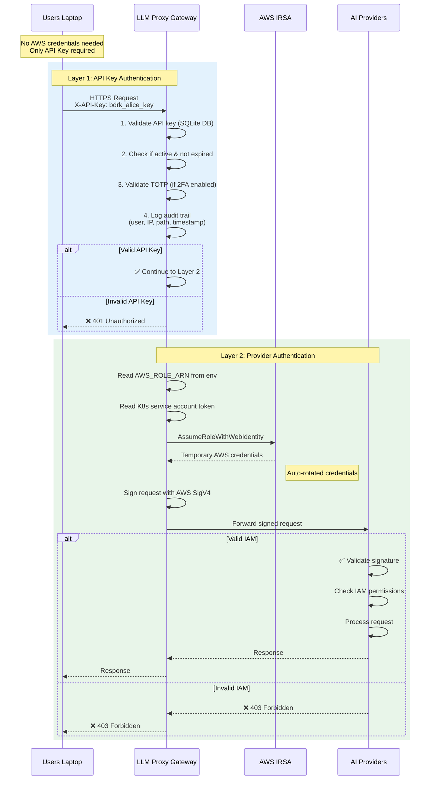

# LLM Proxy Auth Architecture

## 🏗️ Two-Layer Authentication Architecture



---

## 📋 Key Points

### ✅ What Users Need
- **API Key only** (e.g., `bdrk_a1b2c3d4...`)
- **NO AWS credentials** on their laptop
- **NO AWS CLI** required
- **NO IAM roles** to configure
- Just `X-API-Key` header in their requests

### ✅ What the Proxy Has (Automatic)
- **Kubernetes Service Account** with IRSA annotation
- **AWS IAM Role** (configured via Terraform/kubectl)
- **Web Identity Token** (auto-mounted by EKS)
- **Temporary AWS credentials** (auto-rotated every hour)

---

## 🔐 Authentication Flow Example

### Step 1: Alice Makes a Request

```bash
# Alice's laptop (no AWS credentials)
curl -X POST https://bedrock-proxy.example.com/model/claude-3-sonnet/invoke \
  -H "X-API-Key: bdrk_alice_key_abc123" \
  -H "Content-Type: application/json" \
  -d '{"messages":[{"role":"user","content":"Hello!"}]}'
```

### Step 2: Proxy Validates API Key

```go
// internal/middleware/auth_enhanced.go
func EnhancedAPIKeyAuth(apiKeyDB *auth.APIKeyDB, ...) {
    apiKey := c.GetHeader("X-API-Key")

    // Validate against database
    keyInfo, err := apiKeyDB.ValidateAPIKey(apiKey)
    if err != nil {
        c.JSON(401, gin.H{"error": "Invalid API key"})
        return
    }

    // Log audit trail
    apiKeyDB.LogAPIKeyUsage(keyInfo.ID, "auth_success", ...)

    c.Set("user", keyInfo.Name)  // Alice
    c.Next()
}
```

### Step 3: Proxy Uses IRSA to Call Bedrock

```go
// internal/auth/aws_signer.go (AUTOMATIC)
func loadAWSConfig(region string) {
    // 1. Read AWS_ROLE_ARN from env (set by IRSA)
    roleArn := os.Getenv("AWS_ROLE_ARN")
    // → "arn:aws:iam::123456:role/bedrock-proxy-role"

    // 2. Read token file (auto-mounted by K8s)
    tokenFile := os.Getenv("AWS_WEB_IDENTITY_TOKEN_FILE")
    // → "/var/run/secrets/eks.amazonaws.com/serviceaccount/token"

    // 3. Use STS to assume role (automatic)
    cfg, _ := stscreds.NewWebIdentityRoleProvider(
        sts.NewFromConfig(...),
        roleArn,
        stscreds.IdentityTokenFile(tokenFile),
    )

    return cfg  // Contains temp AWS credentials
}
```

### Step 4: Proxy Signs Request to Bedrock

```go
// internal/auth/aws_signer.go
func (s *AWSSigner) SignRequest(req *http.Request, body []byte) {
    // Get temp credentials (from IRSA)
    creds, _ := s.credentials.Retrieve(ctx)

    // Sign with AWS SigV4
    authHeader := fmt.Sprintf(
        "AWS4-HMAC-SHA256 Credential=%s/%s, SignedHeaders=%s, Signature=%s",
        creds.AccessKeyID,      // From IRSA
        credentialScope,        // YYYYMMDD/region/bedrock/aws4_request
        signedHeaders,
        signature,
    )

    req.Header.Set("Authorization", authHeader)
    req.Header.Set("X-Amz-Security-Token", creds.SessionToken)
}
```

### Step 5: Bedrock Validates IAM and Responds

```
AWS Bedrock receives:
✓ Authorization: AWS4-HMAC-SHA256 Credential=ASIA...
✓ X-Amz-Security-Token: IQoJb3JpZ2...
✓ Validates signature ✓
✓ Checks IAM role permissions ✓
✓ Returns model response
```

---

## 🔄 IRSA Configuration (Already Done)

### Kubernetes Service Account
```yaml
apiVersion: v1
kind: ServiceAccount
metadata:
  name: bedrock-proxy-sa
  namespace: bedrock-system
  annotations:
    # This is the IRSA magic!
    eks.amazonaws.com/role-arn: arn:aws:iam::ACCOUNT:role/bedrock-proxy-role
```

### IAM Role Trust Policy
```json
{
  "Version": "2012-10-17",
  "Statement": [{
    "Effect": "Allow",
    "Principal": {
      "Federated": "arn:aws:iam::ACCOUNT:oidc-provider/oidc.eks.REGION.amazonaws.com/id/XXX"
    },
    "Action": "sts:AssumeRoleWithWebIdentity",
    "Condition": {
      "StringEquals": {
        "oidc.eks.REGION.amazonaws.com/id/XXX:sub":
          "system:serviceaccount:bedrock-system:bedrock-proxy-sa"
      }
    }
  }]
}
```

### IAM Role Permissions
```json
{
  "Version": "2012-10-17",
  "Statement": [{
    "Effect": "Allow",
    "Action": [
      "bedrock:InvokeModel",
      "bedrock:InvokeModelWithResponseStream"
    ],
    "Resource": "*"
  }]
}
```

### Pod Configuration
```yaml
spec:
  serviceAccountName: bedrock-proxy-sa  # Links to IRSA
  containers:
  - name: bedrock-proxy
    env:
    # These are AUTO-SET by EKS:
    - name: AWS_ROLE_ARN
      value: "arn:aws:iam::ACCOUNT:role/bedrock-proxy-role"
    - name: AWS_WEB_IDENTITY_TOKEN_FILE
      value: "/var/run/secrets/eks.amazonaws.com/serviceaccount/token"
```

---

## 🎯 What This Means for 3 Users

### Users Configure:
```bash
# Alice's laptop
export BEDROCK_API_KEY='bdrk_alice_key'

# Bob's laptop
export BEDROCK_API_KEY='bdrk_bob_key'

# Charlie's laptop
export BEDROCK_API_KEY='bdrk_charlie_key'
```

### Users Make Requests:
```bash
curl -H "X-API-Key: $BEDROCK_API_KEY" https://bedrock-proxy.example.com/...
```

### Proxy Handles AWS Automatically:
- ✅ Validates user's API key
- ✅ Uses IRSA to get AWS credentials
- ✅ Signs request to Bedrock
- ✅ Returns response to user

### Users NEVER:
- ❌ Configure AWS credentials
- ❌ Install AWS CLI
- ❌ Set up IAM roles
- ❌ Manage access keys
- ❌ Rotate credentials

---

## 📊 Security Benefits

1. **Credential Isolation**: Users never see AWS credentials
2. **Automatic Rotation**: AWS credentials rotate every hour (IRSA)
3. **Centralized Control**: Admin manages API keys, AWS handles IAM
4. **Audit Trail**: Every request logged with user identity
5. **Least Privilege**: Each user gets same Bedrock access (via proxy's role)
6. **No Key Leakage**: User API keys are separate from AWS credentials

---

## 🔍 How to Verify

### Check IRSA is Working
```bash
# 1. Check service account annotation
kubectl get sa bedrock-proxy-sa -n bedrock-system -o yaml | grep eks.amazonaws.com/role-arn

# 2. Check pod environment
kubectl exec -n bedrock-system deployment/bedrock-proxy -- env | grep AWS_

# Expected output:
# AWS_ROLE_ARN=arn:aws:iam::123456:role/bedrock-proxy-role
# AWS_WEB_IDENTITY_TOKEN_FILE=/var/run/secrets/eks.amazonaws.com/serviceaccount/token
# AWS_REGION=us-east-1

# 3. Check token file exists
kubectl exec -n bedrock-system deployment/bedrock-proxy -- \
  cat /var/run/secrets/eks.amazonaws.com/serviceaccount/token
```

### Test End-to-End
```bash
# User makes request with API key only
curl -H "X-API-Key: bdrk_alice_key" https://bedrock-proxy.example.com/health

# Proxy logs show:
# ✓ Validated API key for user: Alice
# ✓ Retrieved AWS credentials via IRSA
# ✓ Signed request to Bedrock
# ✓ Request successful
```

---

## 📚 Summary

| Component | Authentication Method | Configured By | Rotated By |
|-----------|----------------------|---------------|------------|
| **User → Proxy** | API Key | Admin (you) | Manual (or automated) |
| **Proxy → Bedrock** | IAM/IRSA | EKS + Terraform | AWS (automatic, hourly) |

**Users need**: API Key only
**Proxy handles**: Everything AWS-related (automatically via IRSA)

This is the **simplest and most secure** setup for your users! 🎉
