# Cloud-Agnostic Configuration for Multi-Platform Deployment

This document describes how `llmproxy_auth` can be deployed on **any** Kubernetes platform (EKS, AKS, GKE, OKE, self-managed) with automatic platform detection and credential management.

---

## Design Principle

**The proxy should work everywhere without code changes, using the best available credential method for each platform.**


---

## Configuration Schema

### Provider Instance Configuration

The same configuration works on **any** platform, with auto-detection:

```yaml
# configs/provider-instances.yaml
instances:
  # AWS Bedrock - Works on all platforms
  bedrock_us1:
    type: bedrock
    region: us-east-1

    # Credential strategy: Try in order until one works
    authentication:
      strategies:
        - type: workload_identity  # Preferred: AWS IRSA (EKS) or OIDC federation
          provider: aws
        - type: vault              # Fallback: Vault dynamic credentials
          vault_path: aws/sts/bedrock-role
          ttl: 3600
        - type: kubernetes_secret  # Last resort: Static credentials
          secret_name: bedrock-credentials
          secret_key: aws_access_key_id

    endpoints:
      - path: /openai/bedrock_us1
        protocol: openai

  # Azure OpenAI - Works on all platforms
  azure_eastus:
    type: azure
    endpoint: https://my-resource.openai.azure.com

    authentication:
      strategies:
        - type: workload_identity  # Preferred: Azure Managed Identity (AKS)
          provider: azure
        - type: vault              # Fallback: Vault with Azure credentials
          vault_path: azure/creds/openai-role
          ttl: 3600
        - type: kubernetes_secret  # Last resort: API key in secret
          secret_name: azure-credentials
          secret_key: api_key

    endpoints:
      - path: /openai/azure_eastus
        protocol: openai

  # Google Vertex AI - Works on all platforms
  vertex_us_central:
    type: vertex
    project_id: my-gcp-project
    location: us-central1

    authentication:
      strategies:
        - type: workload_identity  # Preferred: GCP Workload Identity (GKE)
          provider: gcp
        - type: vault              # Fallback: Vault with GCP credentials
          vault_path: gcp/token/vertex-role
          ttl: 3600
        - type: kubernetes_secret  # Last resort: Service account key
          secret_name: gcp-credentials
          secret_key: service_account_json

    endpoints:
      - path: /openai/vertex
        protocol: openai

  # OpenAI - Vault or K8s secret (no native workload identity)
  openai:
    type: openai
    base_url: https://api.openai.com/v1

    authentication:
      strategies:
        - type: vault              # Preferred: Vault dynamic secrets
          vault_path: openai/creds/api-key
          ttl: 86400
        - type: kubernetes_secret  # Fallback: Static API key
          secret_name: openai-credentials
          secret_key: api_key

    endpoints:
      - path: /openai/openai
        protocol: openai

# Global settings
platform:
  auto_detect: true  # Automatically detect K8s platform (EKS/AKS/GKE/etc)

  # Optional: Override auto-detection
  # platform_type: eks  # Options: eks, aks, gke, oke, iks, generic

  # Vault configuration (optional, auto-detected if available)
  vault:
    enabled: auto  # Options: auto, true, false
    address: http://vault.vault.svc.cluster.local:8200
    kubernetes_auth:
      role: llmproxy
      service_account: llmproxy-sa

  # Credential refresh settings
  refresh:
    check_interval: 5m      # Check credential expiry every 5 minutes
    renew_before_expiry: 5m # Renew credentials 5 min before expiry
```

---

## Platform Auto-Detection

### Detection Logic

```go
// internal/platform/detector.go
package platform

import (
    "context"
    "os"
    "strings"
)

// PlatformType represents the Kubernetes platform
type PlatformType string

const (
    PlatformEKS     PlatformType = "eks"     // AWS EKS
    PlatformAKS     PlatformType = "aks"     // Azure AKS
    PlatformGKE     PlatformType = "gke"     // Google GKE
    PlatformOKE     PlatformType = "oke"     // Oracle OKE
    PlatformIKS     PlatformType = "iks"     // IBM Cloud Kubernetes
    PlatformGeneric PlatformType = "generic" // Self-managed or other
)

// Platform holds detected platform information
type Platform struct {
    Type     PlatformType
    Features PlatformFeatures
}

// PlatformFeatures describes available platform features
type PlatformFeatures struct {
    AWSWorkloadIdentity   bool // AWS IRSA available
    AzureWorkloadIdentity bool // Azure Managed Identity available
    GCPWorkloadIdentity   bool // GCP Workload Identity available
    OCIResourcePrincipal  bool // OCI Resource Principal available
    IBMComputeResource    bool // IBM Compute Resource available
}

// DetectPlatform automatically detects the Kubernetes platform
func DetectPlatform(ctx context.Context) (*Platform, error) {
    platform := &Platform{
        Type:     PlatformGeneric,
        Features: PlatformFeatures{},
    }

    // Check for AWS EKS
    if os.Getenv("AWS_ROLE_ARN") != "" &&
       os.Getenv("AWS_WEB_IDENTITY_TOKEN_FILE") != "" {
        platform.Type = PlatformEKS
        platform.Features.AWSWorkloadIdentity = true
    }

    // Check for Azure AKS
    if os.Getenv("AZURE_CLIENT_ID") != "" &&
       os.Getenv("AZURE_TENANT_ID") != "" &&
       os.Getenv("AZURE_FEDERATED_TOKEN_FILE") != "" {
        platform.Type = PlatformAKS
        platform.Features.AzureWorkloadIdentity = true
    }

    // Check for Google GKE
    if os.Getenv("GOOGLE_APPLICATION_CREDENTIALS") != "" ||
       fileExists("/var/run/secrets/workload-identity/google-application-credentials.json") {
        platform.Type = PlatformGKE
        platform.Features.GCPWorkloadIdentity = true
    }

    // Check for Oracle OKE
    if os.Getenv("OCI_RESOURCE_PRINCIPAL_VERSION") != "" {
        platform.Type = PlatformOKE
        platform.Features.OCIResourcePrincipal = true
    }

    // Check for IBM Cloud
    if os.Getenv("IBM_CLOUD_API_KEY") != "" {
        platform.Type = PlatformIKS
        platform.Features.IBMComputeResource = true
    }

    // Multi-cloud detection: A cluster might support multiple workload identities
    // This can happen with OIDC federation
    detectCrossCloudIdentities(platform)

    return platform, nil
}

// detectCrossCloudIdentities checks for cross-cloud OIDC federation
func detectCrossCloudIdentities(p *Platform) {
    // Even if running on EKS, check for Azure/GCP federation
    if os.Getenv("AZURE_CLIENT_ID") != "" {
        p.Features.AzureWorkloadIdentity = true
    }
    if os.Getenv("GOOGLE_APPLICATION_CREDENTIALS") != "" {
        p.Features.GCPWorkloadIdentity = true
    }
}

func fileExists(path string) bool {
    _, err := os.Stat(path)
    return err == nil
}
```

---

## Credential Provider Abstraction

### Unified Credential Provider Interface

```go
// internal/auth/credential_provider.go
package auth

import (
    "context"
    "time"
)

// CredentialProvider abstracts all credential acquisition methods
type CredentialProvider interface {
    // GetCredentials returns credentials for the provider
    GetCredentials(ctx context.Context) (*Credentials, error)

    // Refresh refreshes the credentials if they're expiring
    Refresh(ctx context.Context) error

    // IsExpired returns true if credentials need refresh
    IsExpired() bool

    // Type returns the credential provider type
    Type() CredentialType
}

// Credentials holds provider credentials
type Credentials struct {
    // For AWS
    AccessKeyID     string
    SecretAccessKey string
    SessionToken    string

    // For Azure
    AccessToken string

    // For GCP
    TokenSource interface{} // oauth2.TokenSource

    // For API key-based (OpenAI, Anthropic)
    APIKey string

    // Common metadata
    Expiry    time.Time
    ProviderType string
}

// CredentialType represents the credential acquisition method
type CredentialType string

const (
    CredentialTypeWorkloadIdentity CredentialType = "workload_identity"
    CredentialTypeVault            CredentialType = "vault"
    CredentialTypeKubernetesSecret CredentialType = "kubernetes_secret"
    CredentialTypeStatic           CredentialType = "static"
)
```

### Strategy-Based Credential Manager

```go
// internal/auth/credential_manager.go
package auth

import (
    "context"
    "fmt"
    "log"
)

// CredentialManager manages multiple credential strategies with fallback
type CredentialManager struct {
    strategies []CredentialProvider
    current    CredentialProvider
}

// NewCredentialManager creates a credential manager with multiple strategies
func NewCredentialManager(strategies []CredentialProvider) *CredentialManager {
    return &CredentialManager{
        strategies: strategies,
    }
}

// Initialize tries each strategy until one succeeds
func (m *CredentialManager) Initialize(ctx context.Context) error {
    for _, strategy := range m.strategies {
        log.Printf("Trying credential strategy: %s", strategy.Type())

        _, err := strategy.GetCredentials(ctx)
        if err == nil {
            log.Printf("✅ Successfully initialized with %s", strategy.Type())
            m.current = strategy
            return nil
        }

        log.Printf("⚠️  Strategy %s failed: %v", strategy.Type(), err)
    }

    return fmt.Errorf("all credential strategies failed")
}

// GetCredentials returns credentials from the current strategy
func (m *CredentialManager) GetCredentials(ctx context.Context) (*Credentials, error) {
    if m.current == nil {
        return nil, fmt.Errorf("no credential provider initialized")
    }

    // Check if credentials need refresh
    if m.current.IsExpired() {
        if err := m.current.Refresh(ctx); err != nil {
            // Try other strategies on refresh failure
            log.Printf("⚠️  Credential refresh failed for %s: %v", m.current.Type(), err)
            return nil, m.Initialize(ctx)
        }
    }

    return m.current.GetCredentials(ctx)
}
```

### AWS Workload Identity Provider

```go
// internal/auth/aws_workload_identity.go
package auth

import (
    "context"
    "time"

    "github.com/aws/aws-sdk-go-v2/config"
    "github.com/aws/aws-sdk-go-v2/credentials/stscreds"
)

type AWSWorkloadIdentityProvider struct {
    cfg         aws.Config
    credentials *Credentials
}

func NewAWSWorkloadIdentityProvider(ctx context.Context, region string) (*AWSWorkloadIdentityProvider, error) {
    // Auto-detects IRSA from environment
    cfg, err := config.LoadDefaultConfig(ctx,
        config.WithRegion(region),
    )
    if err != nil {
        return nil, err
    }

    return &AWSWorkloadIdentityProvider{
        cfg: cfg,
    }, nil
}

func (p *AWSWorkloadIdentityProvider) GetCredentials(ctx context.Context) (*Credentials, error) {
    if p.credentials != nil && !p.IsExpired() {
        return p.credentials, nil
    }

    creds, err := p.cfg.Credentials.Retrieve(ctx)
    if err != nil {
        return nil, err
    }

    p.credentials = &Credentials{
        AccessKeyID:     creds.AccessKeyID,
        SecretAccessKey: creds.SecretAccessKey,
        SessionToken:    creds.SessionToken,
        Expiry:          creds.Expires,
        ProviderType:    "aws_workload_identity",
    }

    return p.credentials, nil
}

func (p *AWSWorkloadIdentityProvider) Refresh(ctx context.Context) error {
    p.credentials = nil
    _, err := p.GetCredentials(ctx)
    return err
}

func (p *AWSWorkloadIdentityProvider) IsExpired() bool {
    if p.credentials == nil {
        return true
    }
    return time.Now().Add(5 * time.Minute).After(p.credentials.Expiry)
}

func (p *AWSWorkloadIdentityProvider) Type() CredentialType {
    return CredentialTypeWorkloadIdentity
}
```

### Vault Credential Provider

```go
// internal/auth/vault_provider.go
package auth

import (
    "context"
    "fmt"
    "time"

    vault "github.com/hashicorp/vault/api"
)

type VaultCredentialProvider struct {
    client      *vault.Client
    path        string
    ttl         time.Duration
    credentials *Credentials
}

func NewVaultCredentialProvider(ctx context.Context, config VaultConfig) (*VaultCredentialProvider, error) {
    client, err := vault.NewClient(&vault.Config{
        Address: config.Address,
    })
    if err != nil {
        return nil, err
    }

    // Authenticate using Kubernetes auth
    if err := authenticateWithKubernetes(client, config); err != nil {
        return nil, err
    }

    return &VaultCredentialProvider{
        client: client,
        path:   config.Path,
        ttl:    config.TTL,
    }, nil
}

func (p *VaultCredentialProvider) GetCredentials(ctx context.Context) (*Credentials, error) {
    if p.credentials != nil && !p.IsExpired() {
        return p.credentials, nil
    }

    secret, err := p.client.Logical().Read(p.path)
    if err != nil {
        return nil, err
    }

    // Parse based on secret type (AWS STS, API key, etc.)
    p.credentials = parseVaultSecret(secret, p.ttl)

    return p.credentials, nil
}

func (p *VaultCredentialProvider) Refresh(ctx context.Context) error {
    p.credentials = nil
    _, err := p.GetCredentials(ctx)
    return err
}

func (p *VaultCredentialProvider) IsExpired() bool {
    if p.credentials == nil {
        return true
    }
    return time.Now().Add(5 * time.Minute).After(p.credentials.Expiry)
}

func (p *VaultCredentialProvider) Type() CredentialType {
    return CredentialTypeVault
}
```

---

## Configuration Builder

### Auto-Configure Based on Platform

```go
// internal/config/builder.go
package config

import (
    "context"
    "fmt"
    "log"

    "llmproxy/internal/auth"
    "llmproxy/internal/platform"
)

type ProviderInstanceBuilder struct {
    platform *platform.Platform
}

func NewProviderInstanceBuilder(ctx context.Context) (*ProviderInstanceBuilder, error) {
    p, err := platform.DetectPlatform(ctx)
    if err != nil {
        return nil, err
    }

    log.Printf("🔍 Detected platform: %s", p.Type)
    log.Printf("   Features: AWS=%v, Azure=%v, GCP=%v, OCI=%v, IBM=%v",
        p.Features.AWSWorkloadIdentity,
        p.Features.AzureWorkloadIdentity,
        p.Features.GCPWorkloadIdentity,
        p.Features.OCIResourcePrincipal,
        p.Features.IBMComputeResource,
    )

    return &ProviderInstanceBuilder{
        platform: p,
    }, nil
}

// BuildCredentialManager creates a credential manager for a provider instance
func (b *ProviderInstanceBuilder) BuildCredentialManager(
    ctx context.Context,
    instance *ProviderInstance,
) (*auth.CredentialManager, error) {

    var strategies []auth.CredentialProvider

    // Build strategies based on configuration and platform capabilities
    for _, strategyConfig := range instance.Authentication.Strategies {
        provider, err := b.buildStrategy(ctx, strategyConfig, instance)
        if err != nil {
            log.Printf("⚠️  Skipping strategy %s: %v", strategyConfig.Type, err)
            continue
        }
        strategies = append(strategies, provider)
    }

    if len(strategies) == 0 {
        return nil, fmt.Errorf("no credential strategies available for %s", instance.Name)
    }

    manager := auth.NewCredentialManager(strategies)
    if err := manager.Initialize(ctx); err != nil {
        return nil, err
    }

    return manager, nil
}

func (b *ProviderInstanceBuilder) buildStrategy(
    ctx context.Context,
    config AuthStrategyConfig,
    instance *ProviderInstance,
) (auth.CredentialProvider, error) {

    switch config.Type {
    case "workload_identity":
        return b.buildWorkloadIdentity(ctx, config, instance)

    case "vault":
        return b.buildVaultProvider(ctx, config)

    case "kubernetes_secret":
        return b.buildKubernetesSecretProvider(ctx, config)

    default:
        return nil, fmt.Errorf("unknown strategy type: %s", config.Type)
    }
}

func (b *ProviderInstanceBuilder) buildWorkloadIdentity(
    ctx context.Context,
    config AuthStrategyConfig,
    instance *ProviderInstance,
) (auth.CredentialProvider, error) {

    switch config.Provider {
    case "aws":
        if !b.platform.Features.AWSWorkloadIdentity {
            return nil, fmt.Errorf("AWS workload identity not available on this platform")
        }
        return auth.NewAWSWorkloadIdentityProvider(ctx, instance.Region)

    case "azure":
        if !b.platform.Features.AzureWorkloadIdentity {
            return nil, fmt.Errorf("Azure workload identity not available on this platform")
        }
        return auth.NewAzureWorkloadIdentityProvider(ctx)

    case "gcp":
        if !b.platform.Features.GCPWorkloadIdentity {
            return nil, fmt.Errorf("GCP workload identity not available on this platform")
        }
        return auth.NewGCPWorkloadIdentityProvider(ctx, instance.ProjectID)

    default:
        return nil, fmt.Errorf("unknown workload identity provider: %s", config.Provider)
    }
}
```

---

## Deployment Examples

### Same Config, Different Platforms

```yaml
# configs/provider-instances.yaml
# This file works on EKS, AKS, GKE, OKE, and self-managed clusters!

instances:
  bedrock_us1:
    type: bedrock
    region: us-east-1
    authentication:
      strategies:
        - type: workload_identity
          provider: aws
        - type: vault
          vault_path: aws/sts/bedrock
        - type: kubernetes_secret
          secret_name: bedrock-creds
    endpoints:
      - path: /openai/bedrock
```

#### On AWS EKS:
```bash
# Workload identity available → Uses IRSA
✅ AWS IRSA detected
✅ Using workload_identity strategy
```

#### On Azure AKS:
```bash
# Workload identity NOT available → Falls back to Vault
⚠️  AWS workload identity not available on this platform
✅ Vault available at http://vault.vault:8200
✅ Using vault strategy
```

#### On Self-Managed:
```bash
# No workload identity, no Vault → Falls back to K8s secret
⚠️  AWS workload identity not available on this platform
⚠️  Vault not available
✅ Using kubernetes_secret strategy
```

---

## Runtime Behavior

### Startup Sequence

```mermaid
sequenceDiagram
    participant Proxy as LLM Proxy
    participant Detector as Platform Detector
    participant Builder as Config Builder
    participant Strategies as Credential Strategies

    Proxy->>Detector: Detect platform
    Detector-->>Proxy: Platform: EKS, Features: [IRSA=true]

    Proxy->>Builder: Load config
    Builder->>Builder: Read provider-instances.yaml

    loop For each provider instance
        Builder->>Strategies: Try workload_identity
        alt Workload Identity Available
            Strategies-->>Builder: ✅ Success (IRSA)
        else Not Available
            Builder->>Strategies: Try vault
            alt Vault Available
                Strategies-->>Builder: ✅ Success (Vault)
            else Not Available
                Builder->>Strategies: Try kubernetes_secret
                Strategies-->>Builder: ✅ Success (K8s Secret)
            end
        end
    end

    Builder-->>Proxy: All instances configured
    Proxy->>Proxy: Start serving requests
```



---

## Monitoring & Observability

### Metrics

```go
// pkg/metrics/credential_metrics.go
var (
    CredentialStrategyUsed = promauto.NewGaugeVec(
        prometheus.GaugeOpts{
            Name: "llmproxy_credential_strategy_active",
            Help: "Active credential strategy (1=active, 0=inactive)",
        },
        []string{"instance", "provider", "strategy"},
    )

    PlatformDetected = promauto.NewGaugeVec(
        prometheus.GaugeOpts{
            Name: "llmproxy_platform_features",
            Help: "Detected platform features (1=available, 0=unavailable)",
        },
        []string{"platform", "feature"},
    )
)
```

### Example Prometheus Output

```
llmproxy_platform_features{platform="eks",feature="aws_workload_identity"} 1
llmproxy_platform_features{platform="eks",feature="azure_workload_identity"} 0
llmproxy_platform_features{platform="eks",feature="gcp_workload_identity"} 0

llmproxy_credential_strategy_active{instance="bedrock_us1",provider="bedrock",strategy="workload_identity"} 1
llmproxy_credential_strategy_active{instance="bedrock_us1",provider="bedrock",strategy="vault"} 0

llmproxy_credential_strategy_active{instance="azure_eastus",provider="azure",strategy="workload_identity"} 0
llmproxy_credential_strategy_active{instance="azure_eastus",provider="azure",strategy="vault"} 1
```

---

---

## Vault Integration Options

The proxy supports **multiple vault backends** for credential injection:

### Option 1: HashiCorp Vault

```yaml
# Authentication strategy using HashiCorp Vault
authentication:
  strategies:
    - type: vault
      backend: hashicorp
      vault_path: aws/sts/bedrock-role
      vault_address: http://vault.vault.svc:8200
      vault_auth_method: kubernetes
      vault_role: llmproxy
      ttl: 3600
```

### Option 2: AWS Secrets Manager

```yaml
# Authentication strategy using AWS Secrets Manager
authentication:
  strategies:
    - type: vault
      backend: aws_secrets_manager
      secret_arn: arn:aws:secretsmanager:us-east-1:123456:secret:bedrock-api-key
      region: us-east-1
```

### Option 3: Azure Key Vault

```yaml
# Authentication strategy using Azure Key Vault
authentication:
  strategies:
    - type: vault
      backend: azure_key_vault
      vault_name: my-keyvault
      secret_name: bedrock-credentials
      tenant_id: ${AZURE_TENANT_ID}
```

### Option 4: GCP Secret Manager

```yaml
# Authentication strategy using GCP Secret Manager
authentication:
  strategies:
    - type: vault
      backend: gcp_secret_manager
      project_id: my-project
      secret_name: bedrock-api-key
      version: latest
```

---

## Kubernetes Secrets Store CSI Driver Integration

### Universal Vault Solution

Use the **Secrets Store CSI Driver** to inject credentials from ANY vault into the pod as files or environment variables.


### Installation

```bash
# Install Secrets Store CSI Driver
helm repo add secrets-store-csi-driver https://kubernetes-sigs.github.io/secrets-store-csi-driver/charts
helm install csi-secrets-store secrets-store-csi-driver/secrets-store-csi-driver \
  --namespace kube-system

# Install provider-specific drivers
# For HashiCorp Vault
helm install vault-csi-provider hashicorp/vault-csi-provider

# For AWS Secrets Manager
kubectl apply -f https://raw.githubusercontent.com/aws/secrets-store-csi-driver-provider-aws/main/deployment/aws-provider-installer.yaml

# For Azure Key Vault
helm install csi-secrets-store-provider-azure azure/csi-secrets-store-provider-azure

# For GCP Secret Manager
kubectl apply -f https://raw.githubusercontent.com/GoogleCloudPlatform/secrets-store-csi-driver-provider-gcp/main/deploy/provider-gcp-plugin.yaml
```

---

## Configuration Examples by Vault Type

### 1. HashiCorp Vault with CSI Driver

**SecretProviderClass:**

```yaml
apiVersion: secrets-store.csi.x-k8s.io/v1
kind: SecretProviderClass
metadata:
  name: llmproxy-vault-secrets
  namespace: llmproxy-system
spec:
  provider: vault
  parameters:
    vaultAddress: "http://vault.vault.svc:8200"
    roleName: "llmproxy"
    objects: |
      - objectName: "openai-api-key"
        secretPath: "secret/data/openai/api-key"
        secretKey: "key"
      - objectName: "anthropic-api-key"
        secretPath: "secret/data/anthropic/api-key"
        secretKey: "key"
      - objectName: "aws-credentials"
        secretPath: "aws/sts/bedrock-role"
        secretKey: "access_key"
  secretObjects:
    - secretName: injected-vault-secrets
      type: Opaque
      data:
        - objectName: openai-api-key
          key: OPENAI_API_KEY
        - objectName: anthropic-api-key
          key: ANTHROPIC_API_KEY
```

**Deployment:**

```yaml
apiVersion: apps/v1
kind: Deployment
metadata:
  name: llmproxy
  namespace: llmproxy-system
spec:
  template:
    spec:
      serviceAccountName: llmproxy-sa
      volumes:
        - name: secrets-store
          csi:
            driver: secrets-store.csi.k8s.io
            readOnly: true
            volumeAttributes:
              secretProviderClass: "llmproxy-vault-secrets"
      containers:
        - name: llmproxy
          image: llmproxy:latest
          volumeMounts:
            - name: secrets-store
              mountPath: "/mnt/secrets-store"
              readOnly: true
          env:
            # Automatically populated from secretObjects
            - name: OPENAI_API_KEY
              valueFrom:
                secretKeyRef:
                  name: injected-vault-secrets
                  key: OPENAI_API_KEY
            - name: ANTHROPIC_API_KEY
              valueFrom:
                secretKeyRef:
                  name: injected-vault-secrets
                  key: ANTHROPIC_API_KEY
```

### 2. AWS Secrets Manager with CSI Driver

**SecretProviderClass:**

```yaml
apiVersion: secrets-store.csi.x-k8s.io/v1
kind: SecretProviderClass
metadata:
  name: llmproxy-aws-secrets
  namespace: llmproxy-system
spec:
  provider: aws
  parameters:
    objects: |
      - objectName: "openai-api-key"
        objectType: "secretsmanager"
        objectAlias: "openai-key"
        objectVersionLabel: "AWSCURRENT"
        jmesPath:
          - path: "api_key"
            objectAlias: "OPENAI_API_KEY"
      - objectName: "anthropic-api-key"
        objectType: "secretsmanager"
        objectAlias: "anthropic-key"
      - objectName: "azure-credentials"
        objectType: "secretsmanager"
        objectAlias: "azure-creds"
        jmesPath:
          - path: "api_key"
            objectAlias: "AZURE_API_KEY"
  secretObjects:
    - secretName: injected-aws-secrets
      type: Opaque
      data:
        - objectName: OPENAI_API_KEY
          key: OPENAI_API_KEY
        - objectName: anthropic-key
          key: ANTHROPIC_API_KEY
        - objectName: AZURE_API_KEY
          key: AZURE_API_KEY
```

**IAM Policy for Secrets Access:**

```json
{
  "Version": "2012-10-17",
  "Statement": [
    {
      "Effect": "Allow",
      "Action": [
        "secretsmanager:GetSecretValue",
        "secretsmanager:DescribeSecret"
      ],
      "Resource": [
        "arn:aws:secretsmanager:us-east-1:ACCOUNT:secret:openai-api-key*",
        "arn:aws:secretsmanager:us-east-1:ACCOUNT:secret:anthropic-api-key*",
        "arn:aws:secretsmanager:us-east-1:ACCOUNT:secret:azure-credentials*"
      ]
    }
  ]
}
```

### 3. Azure Key Vault with CSI Driver

**SecretProviderClass:**

```yaml
apiVersion: secrets-store.csi.x-k8s.io/v1
kind: SecretProviderClass
metadata:
  name: llmproxy-azure-keyvault
  namespace: llmproxy-system
spec:
  provider: azure
  parameters:
    usePodIdentity: "false"
    useVMManagedIdentity: "true"
    userAssignedIdentityID: "<MANAGED_IDENTITY_CLIENT_ID>"
    keyvaultName: "my-keyvault"
    cloudName: ""
    objects: |
      array:
        - |
          objectName: openai-api-key
          objectType: secret
          objectAlias: OPENAI_API_KEY
        - |
          objectName: anthropic-api-key
          objectType: secret
          objectAlias: ANTHROPIC_API_KEY
        - |
          objectName: bedrock-credentials
          objectType: secret
          objectAlias: AWS_ACCESS_KEY_ID
    tenantId: "<AZURE_TENANT_ID>"
  secretObjects:
    - secretName: injected-keyvault-secrets
      type: Opaque
      data:
        - objectName: OPENAI_API_KEY
          key: OPENAI_API_KEY
        - objectName: ANTHROPIC_API_KEY
          key: ANTHROPIC_API_KEY
```

**Azure RBAC:**

```bash
# Grant Key Vault Secrets User role to managed identity
az role assignment create \
  --role "Key Vault Secrets User" \
  --assignee <MANAGED_IDENTITY_PRINCIPAL_ID> \
  --scope /subscriptions/<SUBSCRIPTION>/resourceGroups/<RG>/providers/Microsoft.KeyVault/vaults/<VAULT_NAME>
```

### 4. GCP Secret Manager with CSI Driver

**SecretProviderClass:**

```yaml
apiVersion: secrets-store.csi.x-k8s.io/v1
kind: SecretProviderClass
metadata:
  name: llmproxy-gcp-secrets
  namespace: llmproxy-system
spec:
  provider: gcp
  parameters:
    secrets: |
      - resourceName: "projects/PROJECT_ID/secrets/openai-api-key/versions/latest"
        path: "OPENAI_API_KEY"
      - resourceName: "projects/PROJECT_ID/secrets/anthropic-api-key/versions/latest"
        path: "ANTHROPIC_API_KEY"
      - resourceName: "projects/PROJECT_ID/secrets/azure-credentials/versions/latest"
        path: "AZURE_API_KEY"
  secretObjects:
    - secretName: injected-gcp-secrets
      type: Opaque
      data:
        - key: OPENAI_API_KEY
          path: OPENAI_API_KEY
        - key: ANTHROPIC_API_KEY
          path: ANTHROPIC_API_KEY
```

**GCP IAM:**

```bash
# Grant Secret Manager Secret Accessor role
gcloud projects add-iam-policy-binding PROJECT_ID \
  --member "serviceAccount:llmproxy@PROJECT_ID.iam.gserviceaccount.com" \
  --role "roles/secretmanager.secretAccessor"
```

---

## Updated Configuration Schema

### Complete Example with All Vault Options

```yaml
# configs/provider-instances.yaml

# Global vault configuration
vaults:
  # HashiCorp Vault
  hashicorp:
    enabled: auto  # auto-detect availability
    address: http://vault.vault.svc:8200
    auth_method: kubernetes
    role: llmproxy
    service_account: llmproxy-sa

  # AWS Secrets Manager
  aws_secrets_manager:
    enabled: auto
    region: us-east-1
    # Uses IRSA for authentication

  # Azure Key Vault
  azure_key_vault:
    enabled: auto
    vault_name: my-keyvault
    tenant_id: ${AZURE_TENANT_ID}
    # Uses Managed Identity for authentication

  # GCP Secret Manager
  gcp_secret_manager:
    enabled: auto
    project_id: my-project
    # Uses Workload Identity for authentication

# Provider instances
instances:
  # OpenAI - Can use any vault
  openai:
    type: openai
    authentication:
      strategies:
        # Try HashiCorp Vault first
        - type: vault
          backend: hashicorp
          path: secret/data/openai/api-key
          key_field: key

        # Fallback to AWS Secrets Manager
        - type: vault
          backend: aws_secrets_manager
          secret_name: openai-api-key
          key_field: api_key

        # Fallback to Azure Key Vault
        - type: vault
          backend: azure_key_vault
          secret_name: openai-api-key

        # Fallback to GCP Secret Manager
        - type: vault
          backend: gcp_secret_manager
          secret_name: openai-api-key
          version: latest

        # Last resort: K8s secret
        - type: kubernetes_secret
          secret_name: openai-credentials
          secret_key: api_key

  # AWS Bedrock - Prefers workload identity, vault as fallback
  bedrock_us1:
    type: bedrock
    region: us-east-1
    authentication:
      strategies:
        # Best: Native workload identity
        - type: workload_identity
          provider: aws

        # Good: Vault with STS dynamic credentials
        - type: vault
          backend: hashicorp
          path: aws/sts/bedrock-role
          ttl: 3600

        # Good: AWS Secrets Manager with static credentials
        - type: vault
          backend: aws_secrets_manager
          secret_name: bedrock-static-credentials
          key_fields:
            access_key_id: access_key_id
            secret_access_key: secret_access_key

  # Azure OpenAI - Prefers workload identity, vault as fallback
  azure_eastus:
    type: azure
    endpoint: https://my-resource.openai.azure.com
    authentication:
      strategies:
        # Best: Native workload identity
        - type: workload_identity
          provider: azure

        # Good: Azure Key Vault
        - type: vault
          backend: azure_key_vault
          secret_name: azure-openai-api-key

        # Fallback: HashiCorp Vault
        - type: vault
          backend: hashicorp
          path: secret/data/azure/openai
          key_field: api_key

  # Google Vertex - Prefers workload identity, vault as fallback
  vertex_us:
    type: vertex
    project_id: my-project
    location: us-central1
    authentication:
      strategies:
        # Best: Native workload identity
        - type: workload_identity
          provider: gcp

        # Good: GCP Secret Manager
        - type: vault
          backend: gcp_secret_manager
          secret_name: vertex-service-account
          version: latest

        # Fallback: HashiCorp Vault
        - type: vault
          backend: hashicorp
          path: gcp/token/vertex-role
```

---

## Vault Provider Implementation

### Unified Vault Interface

```go
// internal/auth/vault/interface.go
package vault

import "context"

// VaultBackend abstracts different vault implementations
type VaultBackend interface {
    // GetSecret retrieves a secret from the vault
    GetSecret(ctx context.Context, path string) (*Secret, error)

    // Type returns the vault backend type
    Type() VaultType

    // IsAvailable checks if this vault backend is accessible
    IsAvailable(ctx context.Context) bool
}

type VaultType string

const (
    VaultTypeHashiCorp         VaultType = "hashicorp"
    VaultTypeAWSSecretsManager VaultType = "aws_secrets_manager"
    VaultTypeAzureKeyVault     VaultType = "azure_key_vault"
    VaultTypeGCPSecretManager  VaultType = "gcp_secret_manager"
)

type Secret struct {
    Data      map[string]interface{}
    LeaseID   string
    Renewable bool
    LeaseDuration int
}
```

### AWS Secrets Manager Provider

```go
// internal/auth/vault/aws_secrets_manager.go
package vault

import (
    "context"
    "encoding/json"

    "github.com/aws/aws-sdk-go-v2/config"
    "github.com/aws/aws-sdk-go-v2/service/secretsmanager"
)

type AWSSecretsManagerBackend struct {
    client *secretsmanager.Client
    region string
}

func NewAWSSecretsManagerBackend(ctx context.Context, region string) (*AWSSecretsManagerBackend, error) {
    cfg, err := config.LoadDefaultConfig(ctx,
        config.WithRegion(region),
    )
    if err != nil {
        return nil, err
    }

    return &AWSSecretsManagerBackend{
        client: secretsmanager.NewFromConfig(cfg),
        region: region,
    }, nil
}

func (b *AWSSecretsManagerBackend) GetSecret(ctx context.Context, secretName string) (*Secret, error) {
    result, err := b.client.GetSecretValue(ctx, &secretsmanager.GetSecretValueInput{
        SecretId: &secretName,
    })
    if err != nil {
        return nil, err
    }

    var data map[string]interface{}
    if err := json.Unmarshal([]byte(*result.SecretString), &data); err != nil {
        // If not JSON, treat as plain string
        data = map[string]interface{}{
            "value": *result.SecretString,
        }
    }

    return &Secret{
        Data:      data,
        Renewable: false,
    }, nil
}

func (b *AWSSecretsManagerBackend) Type() VaultType {
    return VaultTypeAWSSecretsManager
}

func (b *AWSSecretsManagerBackend) IsAvailable(ctx context.Context) bool {
    // Try to list secrets to verify access
    _, err := b.client.ListSecrets(ctx, &secretsmanager.ListSecretsInput{
        MaxResults: aws.Int32(1),
    })
    return err == nil
}
```

---

## Updated Credential Strategy Config

### Credential Provider with Vault Support

```go
// internal/auth/vault_credential_provider.go
package auth

import (
    "context"
    "fmt"
    "time"

    "llmproxy/internal/auth/vault"
)

type VaultCredentialProvider struct {
    backend     vault.VaultBackend
    secretPath  string
    keyField    string
    ttl         time.Duration
    credentials *Credentials
}

func NewVaultCredentialProvider(
    ctx context.Context,
    backend vault.VaultBackend,
    secretPath string,
    keyField string,
    ttl time.Duration,
) (*VaultCredentialProvider, error) {

    if !backend.IsAvailable(ctx) {
        return nil, fmt.Errorf("vault backend %s is not available", backend.Type())
    }

    return &VaultCredentialProvider{
        backend:    backend,
        secretPath: secretPath,
        keyField:   keyField,
        ttl:        ttl,
    }, nil
}

func (p *VaultCredentialProvider) GetCredentials(ctx context.Context) (*Credentials, error) {
    if p.credentials != nil && !p.IsExpired() {
        return p.credentials, nil
    }

    secret, err := p.backend.GetSecret(ctx, p.secretPath)
    if err != nil {
        return nil, err
    }

    // Extract credential from secret data
    var apiKey string
    if p.keyField != "" {
        apiKey = secret.Data[p.keyField].(string)
    } else {
        // Try common key names
        for _, key := range []string{"api_key", "key", "value", "secret"} {
            if val, ok := secret.Data[key]; ok {
                apiKey = val.(string)
                break
            }
        }
    }

    p.credentials = &Credentials{
        APIKey:       apiKey,
        Expiry:       time.Now().Add(p.ttl),
        ProviderType: string(p.backend.Type()),
    }

    return p.credentials, nil
}

func (p *VaultCredentialProvider) Type() CredentialType {
    return CredentialTypeVault
}
```

---

## Benefits of This Approach

### ✅ True Cloud Agnostic
- Same Docker image works everywhere
- No hardcoded platform assumptions
- Deploy once, run anywhere

### ✅ Automatic Optimization
- Uses best available method on each platform
- No manual configuration needed
- Graceful degradation

### ✅ Easy Migration
- Move between clouds without config changes
- Test locally with K8s secrets
- Deploy to production with workload identity

### ✅ Operational Simplicity
- One configuration file for all environments
- Clear fallback hierarchy
- Observable credential strategy in use

---

## Next Steps

1. **Implement platform detector** (`internal/platform/detector.go`)
2. **Create credential provider interface** (`internal/auth/credential_provider.go`)
3. **Build strategy-based manager** (`internal/auth/credential_manager.go`)
4. **Add auto-configuration** (`internal/config/builder.go`)
5. **Update startup logic** to use new system
6. **Add comprehensive tests** for all platforms

---

## Testing Matrix

| Platform | Provider | Expected Strategy | Test Status |
|----------|----------|-------------------|-------------|
| EKS | AWS Bedrock | Workload Identity (IRSA) | 🔄 TODO |
| EKS | Azure OpenAI | Vault | 🔄 TODO |
| AKS | Azure OpenAI | Workload Identity | 🔄 TODO |
| AKS | AWS Bedrock | Vault | 🔄 TODO |
| GKE | Vertex AI | Workload Identity | 🔄 TODO |
| GKE | AWS Bedrock | Vault | 🔄 TODO |
| Self-Managed | All | Vault or K8s Secrets | 🔄 TODO |

---

This makes `llmproxy_auth` truly portable and production-ready for any Kubernetes environment! 🚀
