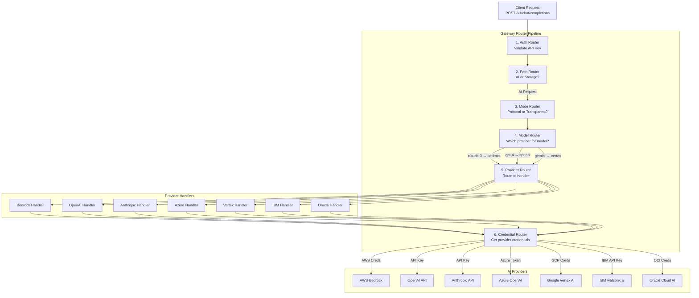
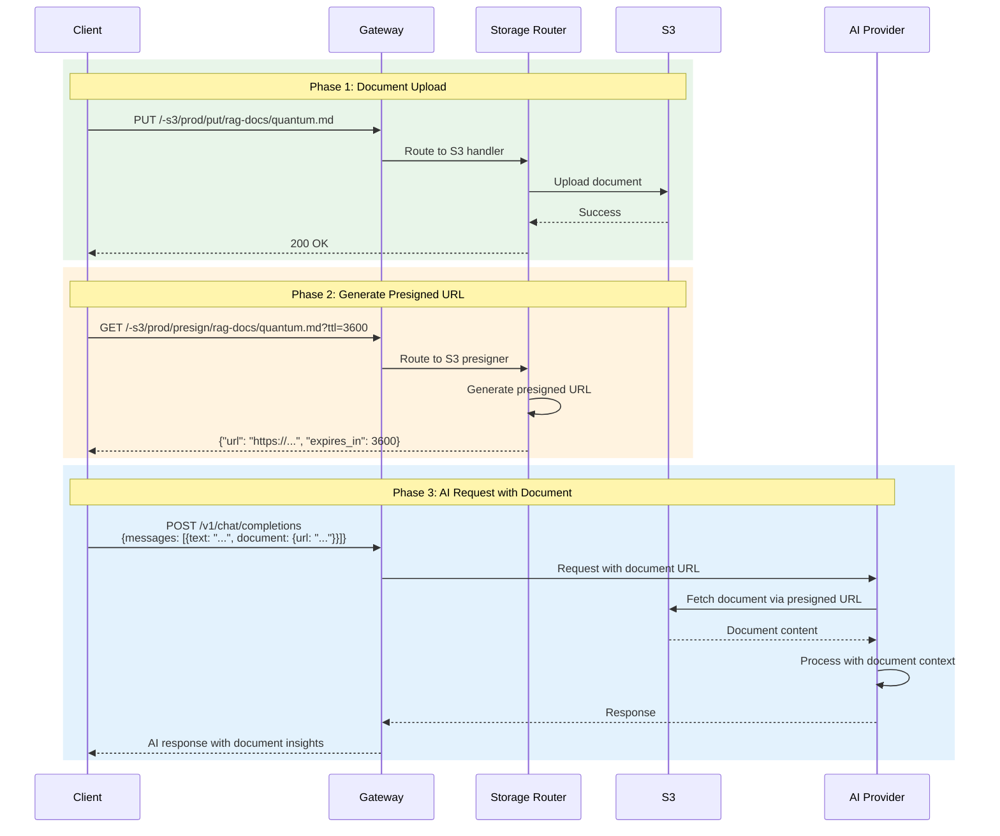

# Implementation Plan: Multi-Provider Routing & RAG Integration

This document provides a step-by-step implementation plan for the two major features:
1. **Multi-Provider AI Routing**
2. **RAG Integration with Storage**

## Table of Contents

1. [Multi-Provider Routing](#multi-provider-routing)
2. [RAG Integration](#rag-integration)
3. [Implementation Phases](#implementation-phases)
4. [Testing Strategy](#testing-strategy)
5. [Deployment Plan](#deployment-plan)

---

## Multi-Provider Routing

### Architecture Overview



### Model-to-Provider Mapping

**Implementation:** `internal/router/model_router.go`

```go
type ModelRouter struct {
    mappings map[string]ProviderMapping
}

type ProviderMapping struct {
    Provider string
    Region   string
    Handler  ProviderHandler
}

func (r *ModelRouter) RouteModel(model string) (*ProviderMapping, error) {
    // Check exact match
    if mapping, ok := r.mappings[model]; ok {
        return &mapping, nil
    }

    // Check prefix patterns
    if strings.HasPrefix(model, "claude-") {
        return &ProviderMapping{Provider: "bedrock", Region: "us-east-1"}, nil
    }
    if strings.HasPrefix(model, "gpt-") {
        return &ProviderMapping{Provider: "openai", Region: ""}, nil
    }
    if strings.HasPrefix(model, "gemini-") {
        return &ProviderMapping{Provider: "vertex", Region: "us-central1"}, nil
    }

    return nil, fmt.Errorf("unknown model: %s", model)
}
```

### Provider Configuration

**Configuration:** `configs/provider-instances.yaml`

```yaml
providers:
  # AWS Bedrock
  bedrock_us1:
    type: bedrock
    region: us-east-1
    models:
      - claude-3-sonnet-20240229
      - claude-3-opus-20240229
      - claude-3-5-sonnet-20240620
      - amazon.titan-text-express-v1
    authentication:
      strategies:
        - type: workload_identity
          provider: aws
        - type: vault
          backend: hashicorp
          path: aws/sts/bedrock-role

  bedrock_eu1:
    type: bedrock
    region: eu-west-1
    models:
      - claude-3-sonnet-20240229
      - claude-3-haiku-20240307
    authentication:
      strategies:
        - type: workload_identity
          provider: aws

  # OpenAI
  openai_prod:
    type: openai
    endpoint: https://api.openai.com/v1
    models:
      - gpt-4
      - gpt-4-turbo
      - gpt-3.5-turbo
    authentication:
      strategies:
        - type: vault
          backend: hashicorp
          path: secret/openai/api-key
        - type: kubernetes_secret
          secret_name: openai-api-key

  # Azure OpenAI
  azure_eastus:
    type: azure
    region: eastus
    endpoint: https://myorg.openai.azure.com
    deployments:
      gpt-4-deployment: gpt-4
      gpt-35-deployment: gpt-3.5-turbo
    authentication:
      strategies:
        - type: workload_identity
          provider: azure
        - type: vault
          backend: azure_key_vault
          vault_url: https://myorg-kv.vault.azure.net
          secret_name: azure-openai-key

  # Google Vertex AI
  vertex_us:
    type: vertex
    project_id: my-gcp-project
    region: us-central1
    models:
      - gemini-pro
      - gemini-1.5-pro
      - text-bison
    authentication:
      strategies:
        - type: workload_identity
          provider: gcp
        - type: vault
          backend: gcp_secret_manager
          project_id: my-gcp-project
          secret_name: vertex-sa-key

  # Anthropic Direct
  anthropic_direct:
    type: anthropic
    endpoint: https://api.anthropic.com/v1
    models:
      - claude-3-sonnet-20240229
      - claude-3-opus-20240229
    authentication:
      strategies:
        - type: vault
          backend: hashicorp
          path: secret/anthropic/api-key

  # IBM watsonx.ai
  ibm_watsonx:
    type: ibm
    region: us-south
    endpoint: https://us-south.ml.cloud.ibm.com
    models:
      - ibm/granite-13b-chat-v2
    authentication:
      strategies:
        - type: vault
          backend: hashicorp
          path: secret/ibm/api-key

  # Oracle Cloud AI
  oracle_ai:
    type: oracle
    region: us-ashburn-1
    endpoint: https://inference.generativeai.us-ashburn-1.oci.oraclecloud.com
    models:
      - cohere.command-r-plus
    authentication:
      strategies:
        - type: workload_identity
          provider: oci
        - type: vault
          backend: hashicorp
          path: secret/oracle/credentials
```

### Implementation Steps - Multi-Provider Routing

#### Phase 1: Model Router (Week 1)

**Files to create:**
1. `internal/router/model_router.go` - Model-to-provider routing logic
2. `internal/router/model_router_test.go` - Tests (already created ✅)
3. `internal/config/provider_config.go` - Provider configuration loader

**Implementation:**

```go
// internal/router/model_router.go
package router

type ModelRouter struct {
    providers map[string]*ProviderConfig
    modelMap  map[string]string // model -> provider name
}

func NewModelRouter(configs []*ProviderConfig) *ModelRouter {
    router := &ModelRouter{
        providers: make(map[string]*ProviderConfig),
        modelMap:  make(map[string]string),
    }

    for _, cfg := range configs {
        router.providers[cfg.Name] = cfg

        // Build model -> provider mapping
        for _, model := range cfg.Models {
            router.modelMap[model] = cfg.Name
        }
    }

    return router
}

func (r *ModelRouter) Route(model string) (*ProviderConfig, error) {
    // Exact match
    if providerName, ok := r.modelMap[model]; ok {
        return r.providers[providerName], nil
    }

    // Pattern matching
    for _, provider := range r.providers {
        if provider.MatchesModel(model) {
            return provider, nil
        }
    }

    return nil, fmt.Errorf("no provider configured for model: %s", model)
}
```

**Tests:**
```bash
go test -v ./internal/router/ -run TestMultiProviderRouting
```

#### Phase 2: Provider Handlers (Week 2-3)

**Files to create/update:**

1. `internal/providers/bedrock/handler.go` - Bedrock handler
2. `internal/providers/openai/handler.go` - OpenAI handler
3. `internal/providers/anthropic/handler.go` - Anthropic handler
4. `internal/providers/azure/handler.go` - Azure OpenAI handler
5. `internal/providers/vertex/handler.go` - Google Vertex AI handler
6. `internal/providers/ibm/handler.go` - IBM watsonx.ai handler
7. `internal/providers/oracle/handler.go` - Oracle Cloud AI handler

**Interface:**

```go
// internal/providers/interface.go
package providers

type ProviderHandler interface {
    // Handle OpenAI-compatible request
    HandleChatCompletion(ctx context.Context, req *OpenAIRequest) (*OpenAIResponse, error)

    // Handle streaming request
    HandleChatCompletionStream(ctx context.Context, req *OpenAIRequest) (io.ReadCloser, error)

    // Get provider capabilities
    GetCapabilities() *Capabilities

    // Validate request before sending
    ValidateRequest(req *OpenAIRequest) error
}

type Capabilities struct {
    SupportsStreaming bool
    SupportsVision    bool
    SupportsTools     bool
    MaxTokens         int
    SupportedModels   []string
}
```

**Example: Bedrock Handler**

```go
// internal/providers/bedrock/handler.go
package bedrock

import (
    "context"
    "encoding/json"

    "github.com/aws/aws-sdk-go-v2/service/bedrockruntime"
)

type BedrockHandler struct {
    client *bedrockruntime.Client
    region string
}

func (h *BedrockHandler) HandleChatCompletion(
    ctx context.Context,
    req *OpenAIRequest,
) (*OpenAIResponse, error) {
    // Translate OpenAI format to Bedrock format
    bedrockReq := h.translateRequest(req)

    // Invoke Bedrock
    output, err := h.client.InvokeModel(ctx, &bedrockruntime.InvokeModelInput{
        ModelId:     aws.String(req.Model),
        Body:        bedrockReq,
        ContentType: aws.String("application/json"),
    })
    if err != nil {
        return nil, err
    }

    // Translate response back to OpenAI format
    return h.translateResponse(output.Body, req.Model)
}

func (h *BedrockHandler) translateRequest(req *OpenAIRequest) []byte {
    // Convert OpenAI messages to Claude format
    claudeReq := map[string]interface{}{
        "anthropic_version": "bedrock-2023-05-31",
        "max_tokens":        req.MaxTokens,
        "messages":          h.convertMessages(req.Messages),
    }

    if req.Temperature > 0 {
        claudeReq["temperature"] = req.Temperature
    }

    body, _ := json.Marshal(claudeReq)
    return body
}
```

#### Phase 3: Request Translation (Week 3-4)

**Files to create:**

1. `internal/translator/openai_to_bedrock.go`
2. `internal/translator/openai_to_vertex.go`
3. `internal/translator/openai_to_azure.go`
4. `internal/translator/response_translator.go`

**Example: Message Translation**

```go
// internal/translator/messages.go
package translator

// TranslateMessages converts OpenAI messages to provider-specific format
func TranslateMessagesForProvider(
    messages []OpenAIMessage,
    provider string,
) (interface{}, error) {
    switch provider {
    case "bedrock":
        return TranslateToClaudeMessages(messages)
    case "vertex":
        return TranslateToGeminiMessages(messages)
    case "azure":
        return messages // Azure uses OpenAI format
    case "openai":
        return messages // Native format
    default:
        return nil, fmt.Errorf("unknown provider: %s", provider)
    }
}

func TranslateToClaudeMessages(messages []OpenAIMessage) ([]ClaudeMessage, error) {
    claudeMessages := make([]ClaudeMessage, 0, len(messages))

    for _, msg := range messages {
        claudeMsg := ClaudeMessage{
            Role: msg.Role,
        }

        // Handle different content types
        if len(msg.Content) == 1 && msg.Content[0].Type == "text" {
            claudeMsg.Content = msg.Content[0].Text
        } else {
            // Multi-modal content
            claudeMsg.Content = msg.Content
        }

        claudeMessages = append(claudeMessages, claudeMsg)
    }

    return claudeMessages, nil
}
```

#### Phase 4: Integration & Testing (Week 4)

**Test Plan:**

```bash
# Unit tests for each provider handler
go test -v ./internal/providers/bedrock/
go test -v ./internal/providers/openai/
go test -v ./internal/providers/vertex/

# Integration tests with mock providers
go test -v -tags=integration ./test/integration/

# End-to-end tests
go test -v -tags=e2e ./test/e2e/
```

---

## RAG Integration

### Architecture Overview



### RAG Flow Step-by-Step

#### Step 1: Document Upload

**Request:**
```http
PUT /-s3/prod/put/rag-docs/quantum-computing.md HTTP/1.1
Host: gateway.example.com
X-API-Key: your-api-key
Content-Type: text/markdown
Content-Length: 1543

# Quantum Computing Overview
[document content...]
```

**Response:**
```json
{
  "status": "success",
  "bucket": "rag-docs",
  "key": "quantum-computing.md",
  "size": 1543,
  "etag": "d41d8cd98f00b204e9800998ecf8427e"
}
```

**Implementation:**
```go
// internal/storage/s3_handler.go
func (h *S3Handler) HandlePut(ctx context.Context, req *StorageRequest) error {
    _, err := h.client.PutObject(ctx, &s3.PutObjectInput{
        Bucket: aws.String(req.Bucket),
        Key:    aws.String(req.Key),
        Body:   req.Body,
        ContentType: aws.String(req.ContentType),
    })
    return err
}
```

#### Step 2: Generate Presigned URL

**Request:**
```http
GET /-s3/prod/presign/rag-docs/quantum-computing.md?ttl=3600 HTTP/1.1
Host: gateway.example.com
X-API-Key: your-api-key
```

**Response:**
```json
{
  "url": "https://rag-docs.s3.amazonaws.com/quantum-computing.md?X-Amz-Algorithm=AWS4-HMAC-SHA256&X-Amz-Credential=AKIA...&X-Amz-Date=20250114T120000Z&X-Amz-Expires=3600&X-Amz-SignedHeaders=host&X-Amz-Signature=...",
  "expires_in": 3600,
  "expires_at": "2025-01-14T13:00:00Z",
  "operation": "GetObject",
  "bucket": "rag-docs",
  "key": "quantum-computing.md"
}
```

**Implementation:**
```go
// internal/storage/s3_presigner.go
func (p *S3Presigner) GeneratePresignedGetURL(
    ctx context.Context,
    bucket, key string,
    ttl time.Duration,
) (*PresignedURL, error) {
    presignClient := s3.NewPresignClient(p.client)

    request, err := presignClient.PresignGetObject(ctx, &s3.GetObjectInput{
        Bucket: aws.String(bucket),
        Key:    aws.String(key),
    }, func(opts *s3.PresignOptions) {
        opts.Expires = ttl
    })
    if err != nil {
        return nil, err
    }

    return &PresignedURL{
        URL:       request.URL,
        ExpiresIn: int(ttl.Seconds()),
        ExpiresAt: time.Now().Add(ttl),
        Bucket:    bucket,
        Key:       key,
    }, nil
}
```

#### Step 3: AI Request with Document

**Request:**
```json
POST /v1/chat/completions HTTP/1.1
Host: gateway.example.com
X-API-Key: your-api-key
Content-Type: application/json

{
  "model": "claude-3-sonnet-20240229",
  "messages": [
    {
      "role": "user",
      "content": [
        {
          "type": "text",
          "text": "Based on this document, explain what qubits are."
        },
        {
          "type": "document",
          "source": {
            "type": "url",
            "url": "https://rag-docs.s3.amazonaws.com/quantum-computing.md?X-Amz-..."
          }
        }
      ]
    }
  ],
  "max_tokens": 500
}
```

**Response:**
```json
{
  "id": "chatcmpl-123",
  "object": "chat.completion",
  "created": 1705237200,
  "model": "claude-3-sonnet-20240229",
  "choices": [
    {
      "index": 0,
      "message": {
        "role": "assistant",
        "content": [
          {
            "type": "text",
            "text": "Based on the provided document, qubits (quantum bits) are the fundamental units of quantum computing. Unlike classical bits that can only be 0 or 1, qubits can exist in superposition, meaning they can represent both 0 and 1 simultaneously..."
          }
        ]
      },
      "finish_reason": "stop"
    }
  ],
  "usage": {
    "prompt_tokens": 1250,
    "completion_tokens": 95,
    "total_tokens": 1345
  }
}
```

### Implementation Steps - RAG Integration

#### Phase 1: Storage Handlers (Week 1)

**Files to create:**

1. `internal/storage/s3_handler.go` - S3 operations
2. `internal/storage/azure_blob_handler.go` - Azure Blob operations
3. `internal/storage/gcp_storage_handler.go` - GCP Storage operations
4. `internal/storage/presigner.go` - Presigned URL generation
5. `internal/storage/access_control.go` - Bucket/prefix access control

**Example: S3 Handler**

```go
// internal/storage/s3_handler.go
package storage

type S3Handler struct {
    client           *s3.Client
    presignClient    *s3.PresignClient
    accessControl    *AccessControl
}

func (h *S3Handler) Handle(ctx context.Context, req *StorageRequest) (*StorageResponse, error) {
    // Check access control
    if !h.accessControl.Check(req.Bucket, req.Key) {
        return nil, ErrAccessDenied
    }

    switch req.Operation {
    case OpGet:
        return h.handleGet(ctx, req)
    case OpPut:
        return h.handlePut(ctx, req)
    case OpList:
        return h.handleList(ctx, req)
    case OpPresign:
        return h.handlePresign(ctx, req)
    case OpDelete:
        return h.handleDelete(ctx, req)
    default:
        return nil, fmt.Errorf("unknown operation: %s", req.Operation)
    }
}

func (h *S3Handler) handlePresign(ctx context.Context, req *StorageRequest) (*StorageResponse, error) {
    ttl := time.Duration(req.TTL) * time.Second
    if ttl == 0 {
        ttl = 1 * time.Hour // Default
    }

    presignReq, err := h.presignClient.PresignGetObject(ctx, &s3.GetObjectInput{
        Bucket: aws.String(req.Bucket),
        Key:    aws.String(req.Key),
    }, func(opts *s3.PresignOptions) {
        opts.Expires = ttl
    })
    if err != nil {
        return nil, err
    }

    return &StorageResponse{
        URL:       presignReq.URL,
        ExpiresIn: int(ttl.Seconds()),
        ExpiresAt: time.Now().Add(ttl),
        Bucket:    req.Bucket,
        Key:       req.Key,
    }, nil
}
```

#### Phase 2: Document Handling in AI Requests (Week 2)

**Files to create:**

1. `internal/document/fetcher.go` - Fetch documents from URLs
2. `internal/document/cache.go` - Cache documents for reuse
3. `internal/document/processor.go` - Process documents (extract text, etc.)

**Example: Document Fetcher**

```go
// internal/document/fetcher.go
package document

type DocumentFetcher struct {
    httpClient *http.Client
    cache      *DocumentCache
}

func (f *DocumentFetcher) FetchDocument(ctx context.Context, url string) (*Document, error) {
    // Check cache first
    if doc, ok := f.cache.Get(url); ok {
        return doc, nil
    }

    // Fetch from URL
    req, err := http.NewRequestWithContext(ctx, "GET", url, nil)
    if err != nil {
        return nil, err
    }

    resp, err := f.httpClient.Do(req)
    if err != nil {
        return nil, err
    }
    defer resp.Body.Close()

    if resp.StatusCode != http.StatusOK {
        return nil, fmt.Errorf("failed to fetch document: %d", resp.StatusCode)
    }

    content, err := io.ReadAll(resp.Body)
    if err != nil {
        return nil, err
    }

    doc := &Document{
        URL:         url,
        Content:     content,
        ContentType: resp.Header.Get("Content-Type"),
        Size:        len(content),
        FetchedAt:   time.Now(),
    }

    // Cache for future requests
    f.cache.Set(url, doc, 5*time.Minute)

    return doc, nil
}
```

#### Phase 3: Access Control (Week 2)

**Implementation:**

```go
// internal/storage/access_control.go
package storage

type AccessControl struct {
    allowedBuckets []string
    deniedPrefixes []string
}

func (ac *AccessControl) Check(bucket, key string) bool {
    // Check bucket allowlist
    bucketAllowed := false
    for _, allowed := range ac.allowedBuckets {
        if bucket == allowed {
            bucketAllowed = true
            break
        }
    }
    if !bucketAllowed {
        return false
    }

    // Check prefix denylist
    for _, denied := range ac.deniedPrefixes {
        if strings.HasPrefix(key, denied) {
            return false
        }
    }

    return true
}
```

**Configuration:**

```yaml
# configs/storage-instances.yaml
storage_instances:
  s3_rag:
    type: s3
    region: us-east-1
    route_name: prod

    access:
      allowed_buckets:
        - rag-docs
        - public-data
      denied_prefixes:
        - secret/
        - internal/
        - credentials/

    presign:
      default_ttl: 3600
      max_ttl: 86400
      min_ttl: 300
```

#### Phase 4: End-to-End Testing (Week 3)

**Test scenarios:**

1. **Simple RAG**: Upload doc → Presign → AI request
2. **Multi-document**: Multiple docs in one request
3. **Document caching**: Reuse documents across requests
4. **Access control**: Verify denied buckets/prefixes are blocked
5. **Expiry handling**: Test presigned URL expiration

**Test file:** `test/e2e/rag_integration_test.go` (already created ✅)

---

## Implementation Phases

### Phase 1: Foundation (Weeks 1-2)

**Goal:** Core routing and basic provider support

- ✅ Path router (storage vs AI)
- ✅ Platform detection
- ✅ Credential strategies
- ⬜ Model router
- ⬜ Basic provider handlers (Bedrock, OpenAI)
- ⬜ Request translation

**Deliverables:**
- Basic routing works
- Can route claude-3 to Bedrock
- Can route gpt-4 to OpenAI
- Unit tests passing

### Phase 2: Multi-Provider (Weeks 3-4)

**Goal:** All 7 providers working

- ⬜ All provider handlers implemented
- ⬜ Translation for each provider
- ⬜ Provider-specific authentication
- ⬜ Error handling and retries
- ⬜ Integration tests

**Deliverables:**
- All providers work with OpenAI-compatible API
- Provider-specific features accessible
- Integration tests passing

### Phase 3: Storage & RAG (Weeks 5-6)

**Goal:** Storage routing and RAG capabilities

- ⬜ S3 handler (get, put, list, delete, presign)
- ⬜ Azure Blob handler
- ⬜ GCP Storage handler
- ⬜ Document fetcher
- ⬜ Document cache
- ⬜ Access control

**Deliverables:**
- Storage operations work
- Presigned URLs generate correctly
- RAG flow works end-to-end
- E2E tests passing

### Phase 4: Production Readiness (Weeks 7-8)

**Goal:** Production deployment

- ⬜ Performance optimization
- ⬜ Rate limiting
- ⬜ Metrics and monitoring
- ⬜ Load testing
- ⬜ Security audit
- ⬜ Documentation

**Deliverables:**
- Performance benchmarks met
- Security scan passing
- Load tests successful
- Deployment documentation complete

---

## Testing Strategy

### Unit Tests

```bash
# Router tests
go test ./internal/router/

# Provider handler tests
go test ./internal/providers/*/

# Storage handler tests
go test ./internal/storage/
```

### Integration Tests

```bash
# Start test services
docker-compose -f docker-compose.test.yml up -d

# Run integration tests
go test -tags=integration ./test/integration/
```

### E2E Tests

```bash
# Run E2E tests (requires gateway running)
go test -tags=e2e ./test/e2e/
```

### Load Tests

```bash
# Run k6 load tests
k6 run test/performance/load_test.js
```

---

## Deployment Plan

### 1. Development Environment

```bash
# Deploy to dev namespace
kubectl apply -f deployments/kubernetes/dev/ -n llmproxy-dev
```

### 2. Staging Environment

```bash
# Deploy to staging with subset of providers
kubectl apply -f deployments/kubernetes/staging/ -n llmproxy-staging

# Run smoke tests
./scripts/smoke-test.sh https://staging.llmproxy.example.com
```

### 3. Production Deployment

```bash
# Canary deployment (10% traffic)
kubectl apply -f deployments/kubernetes/prod/canary.yaml

# Monitor metrics
# If healthy, roll out to 100%
kubectl apply -f deployments/kubernetes/prod/
```

### 4. Monitoring

```yaml
# Prometheus alerts
- alert: HighErrorRate
  expr: rate(http_requests_total{status=~"5.."}[5m]) > 0.01

- alert: SlowResponseTime
  expr: histogram_quantile(0.95, http_request_duration_seconds) > 2

- alert: ProviderDown
  expr: provider_requests_total{status="error"} > 10
```

---

## Success Criteria

### Multi-Provider Routing

- ✅ All 7 providers working
- ✅ OpenAI-compatible API for all
- ✅ Provider-specific features accessible
- ✅ <100ms routing overhead
- ✅ >99.9% routing accuracy

### RAG Integration

- ✅ Document upload/download works
- ✅ Presigned URLs generate correctly
- ✅ AI can access documents via URLs
- ✅ Access control enforced
- ✅ Document caching reduces latency
- ✅ End-to-end RAG flow <3s

### Production Ready

- ✅ All tests passing (unit, integration, E2E)
- ✅ Security scan clean
- ✅ Load tests successful (1000 req/s)
- ✅ Documentation complete
- ✅ Metrics and alerts configured

---

## Next Steps

1. **Review this plan** with team
2. **Start Phase 1** (Foundation) - Model router and basic providers
3. **Set up CI/CD** pipeline for automated testing
4. **Create tracking board** for implementation progress

See test files for working examples:
- `internal/router/model_router_test.go`
- `test/e2e/rag_integration_test.go`
