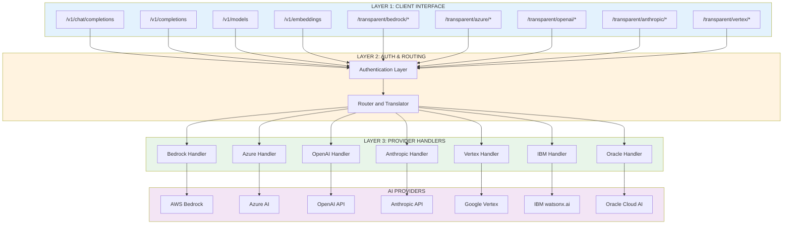

# Multi-Provider AI Proxy Architecture

## 🎯 Vision

Transform the Bedrock IAM Proxy into a **unified AI gateway** that:

1. **Multi-Provider Support**: Transparent proxy to AWS Bedrock, Azure AI, OpenAI, Anthropic Direct, Google Vertex AI
2. **OpenAI Compatibility**: Expose OpenAI-compatible API endpoints that route to any backend
3. **Security-First**: Maintain existing multi-layer authentication architecture
4. **Developer-Friendly**: One proxy, any AI provider, consistent authentication

---

## 🏗️ Three-Layer Architecture



---

## 📁 Project Structure

```
bedrock-proxy-iam/
├── cmd/
│   └── server/
│       └── main.go                    # Entry point with multi-provider routing
│
├── internal/
│   ├── auth/                          # Authentication layer
│   │   ├── apikey_db.go              # User API key management (existing)
│   │   ├── totp.go                   # 2FA support (existing)
│   │   ├── aws_signer.go             # AWS SigV4 signing (existing)
│   │   ├── azure_signer.go           # NEW: Azure AD token + API key
│   │   └── gcp_signer.go             # NEW: GCP service account JWT
│   │
│   ├── middleware/                    # HTTP middleware
│   │   ├── auth_enhanced.go          # User authentication (existing)
│   │   ├── logging.go                # Request logging (existing)
│   │   ├── metrics.go                # Prometheus metrics (existing)
│   │   └── security.go               # Security headers (existing)
│   │
│   ├── providers/                     # NEW: Provider implementations
│   │   ├── interface.go              # Provider interface definition
│   │   ├── bedrock/
│   │   │   ├── bedrock.go            # AWS Bedrock handler (refactored from proxy/)
│   │   │   └── models.go             # Model definitions
│   │   ├── azure/
│   │   │   ├── azure.go              # Azure AI handler
│   │   │   └── models.go             # Model mappings
│   │   ├── openai/
│   │   │   ├── openai.go             # OpenAI handler
│   │   │   └── models.go             # Model list
│   │   ├── anthropic/
│   │   │   ├── anthropic.go          # Anthropic Direct API handler
│   │   │   └── models.go             # Model definitions
│   │   └── vertex/
│   │       ├── vertex.go             # Google Vertex AI handler
│   │       └── models.go             # Model mappings
│   │
│   ├── translator/                    # NEW: OpenAI API translation layer
│   │   ├── openai_to_bedrock.go      # OpenAI → Bedrock format
│   │   ├── openai_to_azure.go        # OpenAI → Azure format
│   │   ├── openai_to_anthropic.go    # OpenAI → Anthropic format
│   │   ├── openai_to_vertex.go       # OpenAI → Vertex format
│   │   ├── response_normalizer.go    # Normalize all responses to OpenAI format
│   │   └── streaming.go              # Streaming response handler
│   │
│   ├── router/                        # NEW: Smart routing logic
│   │   ├── model_mapper.go           # Model name → Provider mapping
│   │   ├── config.go                 # Route configuration
│   │   └── router.go                 # Route selection logic
│   │
│   └── health/                        # Health checks (existing)
│       └── checker.go
│
├── pkg/
│   └── metrics/                       # Prometheus metrics (existing)
│       └── metrics.go
│
├── configs/
│   ├── model-mapping.yaml            # NEW: Model to provider mappings
│   └── provider-config.yaml          # NEW: Provider-specific configurations
│
└── docs/
    ├── ARCHITECTURE.md               # Original architecture (existing)
    ├── MULTI-PROVIDER-ARCHITECTURE.md # This document
    ├── PROVIDER-GUIDE.md             # NEW: Guide for each provider
    └── OPENAI-COMPATIBILITY.md       # NEW: OpenAI API compatibility matrix
```

---

## 🔌 Provider Interface

All providers implement a common interface:

```go
// internal/providers/interface.go
package providers

import (
	"context"
	"io"
	"net/http"
)

// Provider defines the interface that all AI providers must implement
type Provider interface {
	// Name returns the provider identifier (bedrock, azure, openai, anthropic, vertex)
	Name() string

	// HealthCheck verifies the provider is accessible
	HealthCheck(ctx context.Context) error

	// Invoke sends a request to the provider's native API
	// Returns response body, status code, headers, and error
	Invoke(ctx context.Context, request *ProviderRequest) (*ProviderResponse, error)

	// InvokeStreaming handles streaming responses (for chat completions)
	InvokeStreaming(ctx context.Context, request *ProviderRequest) (io.ReadCloser, error)

	// ListModels returns available models for this provider
	ListModels(ctx context.Context) ([]Model, error)

	// GetModelInfo returns details about a specific model
	GetModelInfo(ctx context.Context, modelID string) (*Model, error)
}

// ProviderRequest wraps the provider-specific request
type ProviderRequest struct {
	Method      string            // HTTP method (POST, GET, etc.)
	Path        string            // API endpoint path
	Headers     map[string]string // HTTP headers
	Body        []byte            // Request body (JSON)
	QueryParams map[string]string // URL query parameters
	Metadata    map[string]any    // Additional context (user info, etc.)
}

// ProviderResponse wraps the provider's response
type ProviderResponse struct {
	StatusCode int               // HTTP status code
	Headers    map[string]string // Response headers
	Body       []byte            // Response body (JSON)
	Metadata   map[string]any    // Additional metadata (latency, tokens, etc.)
}

// Model represents an AI model
type Model struct {
	ID          string   // Model identifier (e.g., "gpt-4", "claude-3-sonnet")
	Provider    string   // Provider name
	Name        string   // Human-readable name
	Description string   // Model description
	Capabilities []string // Features: "chat", "completion", "embeddings", "streaming"
	ContextWindow int     // Max context length
	InputPrice   float64  // Price per 1M input tokens (USD)
	OutputPrice  float64  // Price per 1M output tokens (USD)
}
```

---

## 🌐 API Endpoints

### 1. Native Provider APIs (Transparent Proxy)

Direct access to each provider's native API:

```bash
# AWS Bedrock
POST /providers/bedrock/model/anthropic.claude-3-sonnet-20240229-v1:0/invoke
POST /providers/bedrock/model/{model-id}/invoke-with-response-stream

# Azure AI
POST /providers/azure/openai/deployments/{deployment-id}/chat/completions

# OpenAI
POST /providers/openai/v1/chat/completions
POST /providers/openai/v1/completions

# Anthropic Direct
POST /providers/anthropic/v1/messages
POST /providers/anthropic/v1/complete

# Google Vertex AI
POST /providers/vertex/v1/projects/{project}/locations/{location}/publishers/anthropic/models/{model}:streamRawPredict
```

**Use cases:**
- Advanced users who need provider-specific features
- Testing different providers
- Debugging
- Provider-specific optimizations

### 2. OpenAI-Compatible API (Unified Interface)

Standard OpenAI API format routes to any provider:

```bash
# Chat completions (maps to any provider)
POST /v1/chat/completions
{
  "model": "gpt-4",  # or "claude-3-sonnet", "gemini-pro", etc.
  "messages": [{"role": "user", "content": "Hello!"}],
  "stream": true
}

# Text completions (legacy)
POST /v1/completions

# Embeddings
POST /v1/embeddings

# Models list
GET /v1/models

# Model details
GET /v1/models/{model-id}
```

**Use cases:**
- Drop-in replacement for OpenAI
- Easy migration from OpenAI to other providers
- Framework compatibility (LangChain, LlamaIndex, etc.)
- A/B testing across providers

---

## 🗺️ Model Mapping Configuration

```yaml
# configs/model-mapping.yaml

# OpenAI model names map to provider-specific models
model_mappings:
  # GPT-4 family → Multiple providers
  gpt-4:
    default_provider: openai
    providers:
      openai:
        model: gpt-4-0125-preview
        api_version: "2024-02-01"
      azure:
        deployment: gpt-4-deployment
        api_version: "2024-02-15-preview"

  gpt-4-turbo:
    default_provider: openai
    providers:
      openai:
        model: gpt-4-turbo-preview

  # Claude family → Anthropic or Bedrock
  claude-3-opus:
    default_provider: bedrock
    providers:
      bedrock:
        model: anthropic.claude-3-opus-20240229-v1:0
      anthropic:
        model: claude-3-opus-20240229

  claude-3-sonnet:
    default_provider: bedrock
    providers:
      bedrock:
        model: anthropic.claude-3-sonnet-20240229-v1:0
      anthropic:
        model: claude-3-sonnet-20240229

  claude-3-haiku:
    default_provider: bedrock
    providers:
      bedrock:
        model: anthropic.claude-3-haiku-20240307-v1:0
      anthropic:
        model: claude-3-haiku-20240307

  # Gemini family → Vertex AI
  gemini-pro:
    default_provider: vertex
    providers:
      vertex:
        model: gemini-1.5-pro
        project: ${GCP_PROJECT_ID}
        location: us-central1

  gemini-flash:
    default_provider: vertex
    providers:
      vertex:
        model: gemini-1.5-flash
        project: ${GCP_PROJECT_ID}
        location: us-central1

  # Amazon Titan → Bedrock only
  amazon-titan-text:
    default_provider: bedrock
    providers:
      bedrock:
        model: amazon.titan-text-express-v1

# Provider routing rules
routing:
  # Route by model name pattern
  patterns:
    - pattern: "^gpt-"
      default_provider: openai
    - pattern: "^claude-"
      default_provider: bedrock
    - pattern: "^gemini-"
      default_provider: vertex

  # Fallback behavior
  fallback:
    enabled: true
    providers:
      - openai
      - bedrock
      - anthropic

  # Load balancing (future enhancement)
  load_balancing:
    enabled: false
    strategy: round_robin  # or: least_latency, random
```

---

## 🔄 Request Flow Examples

### Example 1: OpenAI-Compatible Request → Bedrock

**Client Request:**
```bash
curl -X POST http://localhost:8080/v1/chat/completions \
  -H "X-API-Key: bdrk_alice_key" \
  -H "Content-Type: application/json" \
  -d '{
    "model": "claude-3-sonnet",
    "messages": [{"role": "user", "content": "Hello!"}],
    "max_tokens": 1024,
    "temperature": 0.7,
    "stream": false
  }'
```

**Internal Flow:**

1. **Auth Layer** (middleware):
   ```
   ✓ Validate X-API-Key: bdrk_alice_key
   ✓ User: Alice
   ✓ Log audit: Alice accessed /v1/chat/completions
   ```

2. **Router** (internal/router):
   ```
   ✓ Parse model: "claude-3-sonnet"
   ✓ Look up mapping: claude-3-sonnet → bedrock
   ✓ Target: internal/providers/bedrock
   ```

3. **Translator** (internal/translator):
   ```go
   // Transform OpenAI format → Bedrock format
   {
     "anthropic_version": "bedrock-2023-05-31",
     "messages": [{"role": "user", "content": "Hello!"}],
     "max_tokens": 1024,
     "temperature": 0.7
   }
   ```

4. **Bedrock Provider** (internal/providers/bedrock):
   ```
   ✓ Sign request with AWS SigV4 (using IRSA credentials)
   ✓ POST https://bedrock-runtime.us-east-1.amazonaws.com/model/anthropic.claude-3-sonnet-20240229-v1:0/invoke
   ✓ Receive response
   ```

5. **Response Normalizer** (internal/translator):
   ```go
   // Transform Bedrock response → OpenAI format
   {
     "id": "chatcmpl-xyz123",
     "object": "chat.completion",
     "created": 1234567890,
     "model": "claude-3-sonnet",
     "choices": [{
       "index": 0,
       "message": {"role": "assistant", "content": "..."},
       "finish_reason": "stop"
     }],
     "usage": {
       "prompt_tokens": 10,
       "completion_tokens": 20,
       "total_tokens": 30
     }
   }
   ```

6. **Response to Client**:
   ```
   ✓ Log metrics: latency, tokens, status
   ✓ Return OpenAI-formatted response
   ```

---

### Example 2: Native Bedrock API (Direct Pass-Through)

**Client Request:**
```bash
curl -X POST http://localhost:8080/providers/bedrock/model/anthropic.claude-3-sonnet-20240229-v1:0/invoke \
  -H "X-API-Key: bdrk_alice_key" \
  -H "Content-Type: application/json" \
  -d '{
    "anthropic_version": "bedrock-2023-05-31",
    "messages": [{"role": "user", "content": "Hello!"}],
    "max_tokens": 1024
  }'
```

**Internal Flow:**

1. **Auth Layer**: Validate API key
2. **Router**: Detect `/providers/bedrock/*` → direct to Bedrock provider
3. **Bedrock Provider**: Pass-through request (no translation)
4. **AWS Signing**: Apply SigV4 signature
5. **Forward**: Send to Bedrock
6. **Response**: Return raw Bedrock response (no normalization)

---

## 🔐 Provider Authentication

Each provider has different authentication requirements. The proxy handles them all:

### AWS Bedrock
```yaml
# Existing IRSA setup (no changes needed)
provider: bedrock
auth:
  method: irsa  # IAM Roles for Service Accounts
  service_account: bedrock-proxy-sa
  iam_role: arn:aws:iam::123456:role/bedrock-proxy-role
  # Credentials automatically provided by EKS
```

### Azure AI
```yaml
provider: azure
auth:
  method: azure_ad_token
  config:
    # Option 1: Managed Identity (recommended)
    managed_identity_client_id: ${AZURE_CLIENT_ID}

    # Option 2: Service Principal
    tenant_id: ${AZURE_TENANT_ID}
    client_id: ${AZURE_CLIENT_ID}
    client_secret: ${AZURE_CLIENT_SECRET}

    # Azure OpenAI specific
    endpoint: https://YOUR_RESOURCE.openai.azure.com
    api_version: "2024-02-15-preview"
```

### OpenAI
```yaml
provider: openai
auth:
  method: api_key
  config:
    api_key: ${OPENAI_API_KEY}  # Set in Kubernetes secret
    organization: ${OPENAI_ORG_ID}  # Optional
```

### Anthropic Direct
```yaml
provider: anthropic
auth:
  method: api_key
  config:
    api_key: ${ANTHROPIC_API_KEY}  # Set in Kubernetes secret
```

### Google Vertex AI
```yaml
provider: vertex
auth:
  method: gcp_service_account
  config:
    # Option 1: Workload Identity (GKE)
    workload_identity: true
    service_account: bedrock-proxy@project.iam.gserviceaccount.com

    # Option 2: Service account key file
    credentials_file: /secrets/gcp-sa-key.json

    # Vertex AI specific
    project_id: ${GCP_PROJECT_ID}
    location: us-central1
```

---

## 📊 Metrics & Observability

Enhanced metrics for multi-provider setup:

```go
// Existing metrics (keep)
bedrock_proxy_requests_total
bedrock_proxy_request_duration_seconds

// New provider-specific metrics
ai_proxy_requests_total{provider="bedrock|azure|openai|anthropic|vertex", model="...", status="..."}
ai_proxy_request_duration_seconds{provider="...", model="..."}
ai_proxy_tokens_total{provider="...", model="...", type="input|output"}
ai_proxy_cost_usd_total{provider="...", model="..."}
ai_proxy_provider_errors_total{provider="...", error_type="..."}

// OpenAI compatibility metrics
ai_proxy_translation_duration_seconds{from="openai", to="..."}
ai_proxy_openai_requests_total{target_provider="..."}
```

### Grafana Dashboard Example

```
┌──────────────────────────────────────────────────────────────┐
│  AI Proxy Overview                                           │
├──────────────────────────────────────────────────────────────┤
│                                                              │
│  Total Requests:  15,234                                    │
│  Total Tokens:    1.2M                                      │
│  Avg Latency:     850ms                                     │
│  Error Rate:      0.3%                                      │
│                                                              │
├──────────────────────────────────────────────────────────────┤
│  Requests by Provider                                        │
│                                                              │
│  █████████████████████ Bedrock    (65%)                    │
│  ████████████ OpenAI              (25%)                    │
│  ████ Azure                        (8%)                    │
│  █ Anthropic                       (2%)                    │
│                                                              │
├──────────────────────────────────────────────────────────────┤
│  Most Popular Models                                         │
│                                                              │
│  1. claude-3-sonnet      (4,521 requests)                  │
│  2. gpt-4-turbo          (3,102 requests)                  │
│  3. claude-3-opus        (1,873 requests)                  │
│  4. gemini-pro           (987 requests)                    │
│                                                              │
├──────────────────────────────────────────────────────────────┤
│  Provider Health                                             │
│                                                              │
│  ✅ Bedrock     99.8% uptime    820ms avg                   │
│  ✅ OpenAI      99.5% uptime    650ms avg                   │
│  ✅ Azure       99.9% uptime    780ms avg                   │
│  ⚠️  Anthropic   98.2% uptime    920ms avg (elevated latency)│
│  ✅ Vertex      99.7% uptime    710ms avg                   │
│                                                              │
└──────────────────────────────────────────────────────────────┘
```

---

## 🚀 Implementation Phases

### Phase 1: Foundation (Week 1-2)
- [x] Create multi-provider architecture document
- [ ] Refactor existing `internal/proxy/bedrock.go` → `internal/providers/bedrock/`
- [ ] Create `internal/providers/interface.go`
- [ ] Create `internal/router/` for routing logic
- [ ] Create `configs/model-mapping.yaml`
- [ ] Update `cmd/server/main.go` routing

### Phase 2: Azure AI Support (Week 2-3)
- [ ] Implement `internal/auth/azure_signer.go`
- [ ] Implement `internal/providers/azure/azure.go`
- [ ] Add Azure configuration to `provider-config.yaml`
- [ ] Test native Azure API pass-through
- [ ] Add Azure metrics

### Phase 3: OpenAI & Anthropic Support (Week 3-4)
- [ ] Implement `internal/providers/openai/openai.go`
- [ ] Implement `internal/providers/anthropic/anthropic.go`
- [ ] Test native API pass-through for both
- [ ] Add provider-specific metrics

### Phase 4: Vertex AI Support (Week 4-5)
- [ ] Implement `internal/auth/gcp_signer.go`
- [ ] Implement `internal/providers/vertex/vertex.go`
- [ ] Add GCP Workload Identity support
- [ ] Test Vertex AI integration

### Phase 5: OpenAI Compatibility Layer (Week 5-7)
- [ ] Implement `internal/translator/openai_to_bedrock.go` (POC)
- [ ] Implement `internal/translator/response_normalizer.go`
- [ ] Add `/v1/chat/completions` endpoint
- [ ] Add streaming support
- [ ] Test OpenAI SDK compatibility

### Phase 6: Complete Translations (Week 7-9)
- [ ] Implement all OpenAI → Provider translators
- [ ] Implement `/v1/completions`
- [ ] Implement `/v1/embeddings`
- [ ] Implement `/v1/models`
- [ ] Add comprehensive tests

### Phase 7: Production Hardening (Week 9-10)
- [ ] Load balancing between providers
- [ ] Fallback logic (if one provider fails, try another)
- [ ] Cost tracking per user
- [ ] Enhanced monitoring dashboards
- [ ] Documentation updates

---

## 🎯 Success Criteria

### For Native Provider APIs
✅ Each provider accessible via `/providers/{name}/*`
✅ Auth handled automatically per provider
✅ Pass-through with minimal latency overhead (<10ms)
✅ Full feature support (streaming, etc.)

### For OpenAI Compatibility
✅ Drop-in replacement for OpenAI SDK
✅ Model name routing works correctly
✅ Request/response format 100% compatible
✅ Streaming works across all providers
✅ Error responses match OpenAI format

### For Operations
✅ Metrics cover all providers
✅ Costs tracked per provider/model/user
✅ Health checks for all providers
✅ Graceful degradation when provider unavailable
✅ Comprehensive logging and audit trail

---

## 🔮 Future Enhancements

1. **Intelligent Routing**
   - Cost-optimized routing (cheapest provider for request)
   - Latency-optimized routing (fastest provider)
   - Fallback chains (Bedrock → Anthropic → OpenAI)

2. **Advanced Features**
   - Request caching (dedupe identical requests)
   - Response caching (semantic cache)
   - A/B testing framework
   - Canary deployments

3. **Cost Management**
   - Per-user budget limits
   - Cost alerts and notifications
   - Provider cost comparison reports
   - Automatic provider switching based on budget

4. **Additional Providers**
   - Cohere
   - AI21 Labs
   - Hugging Face Inference API
   - Together AI
   - Replicate

5. **Enterprise Features**
   - Multi-tenancy with provider isolation
   - Custom model fine-tuning integration
   - Data residency controls
   - Compliance reporting (GDPR, HIPAA, etc.)

---

## 📚 Related Documentation

- [Original Architecture](./ARCHITECTURE.md) - Current Bedrock-only architecture
- [Provider Guide](./PROVIDER-GUIDE.md) - Setup guide for each provider
- [OpenAI Compatibility](./OPENAI-COMPATIBILITY.md) - API compatibility matrix
- [Authorization Guide](./AUTHORIZATION.md) - User authentication setup
- [Security Quick Start](./SECURITY-QUICKSTART.md) - Security setup

---

## 💡 Key Design Decisions

### Why Separate Native and OpenAI APIs?

1. **Flexibility**: Power users need provider-specific features
2. **Simplicity**: OpenAI API users want zero config
3. **Debugging**: Native APIs easier to troubleshoot
4. **Migration**: Gradual migration path for users

### Why Provider Interface Pattern?

1. **Extensibility**: Easy to add new providers
2. **Testing**: Mock providers for unit tests
3. **Consistency**: All providers behave the same
4. **Maintenance**: Changes isolated to provider code

### Why YAML Configuration?

1. **Dynamic**: Change routing without recompilation
2. **GitOps**: Configuration as code
3. **Override**: Environment-specific configs
4. **Transparency**: Users can see routing logic

---

## 🎉 Summary

This architecture transforms the Bedrock IAM Proxy into a **universal AI gateway** that:

- ✅ Supports 5 major AI providers out of the box
- ✅ Provides OpenAI-compatible API for easy migration
- ✅ Maintains security-first design with multi-layer auth
- ✅ Offers both native and unified API access
- ✅ Enables intelligent routing and cost optimization
- ✅ Built on proven Go patterns and existing solid foundation

**Next Steps**: Begin Phase 1 implementation! 🚀
