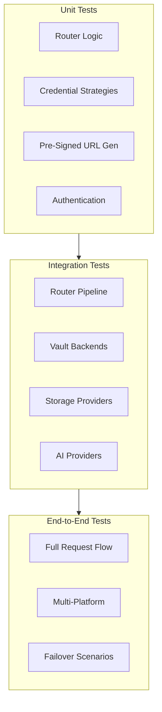

# Testing Guide for LLM Proxy Auth

This guide covers testing strategies for all components of the LLM Proxy Auth gateway, including AI provider routing, storage routing, credential management, and multi-platform support.

## Table of Contents

1. [Testing Strategy Overview](#testing-strategy-overview)
2. [Local Development Setup](#local-development-setup)
3. [Unit Testing](#unit-testing)
4. [Integration Testing](#integration-testing)
5. [Platform-Specific Testing](#platform-specific-testing)
6. [Storage Testing](#storage-testing)
7. [Credential Strategy Testing](#credential-strategy-testing)
8. [End-to-End Testing](#end-to-end-testing)
9. [Performance Testing](#performance-testing)

## Testing Strategy Overview



## Local Development Setup

### Prerequisites

```bash
# Install dependencies
go install github.com/golang/mock/mockgen@latest
go install gotest.tools/gotestsum@latest

# Install testing tools
go get -u github.com/stretchr/testify/assert
go get -u github.com/stretchr/testify/mock
go get -u github.com/aws/aws-sdk-go-v2/service/s3
go get -u github.com/Azure/azure-sdk-for-go/sdk/storage/azblob
```

### Mock Environment Setup

Create a `.env.test` file for local testing:

```bash
# .env.test - Mock environment variables for testing

# Platform simulation (change to test different platforms)
TESTING_PLATFORM=eks  # eks, aks, gke, oke, generic

# AWS IRSA simulation (for EKS testing)
AWS_ROLE_ARN=arn:aws:iam::123456789012:role/test-llmproxy-role
AWS_WEB_IDENTITY_TOKEN_FILE=/tmp/test-token
AWS_REGION=us-east-1

# Azure Managed Identity simulation (for AKS testing)
AZURE_CLIENT_ID=12345678-1234-1234-1234-123456789012
AZURE_FEDERATED_TOKEN_FILE=/tmp/test-azure-token
AZURE_TENANT_ID=87654321-4321-4321-4321-210987654321

# GCP Workload Identity simulation (for GKE testing)
GOOGLE_APPLICATION_CREDENTIALS=/tmp/test-gcp-sa.json
GCP_PROJECT_ID=test-project-123

# Vault configuration
VAULT_ADDR=http://localhost:8200
VAULT_TOKEN=test-token
VAULT_NAMESPACE=test

# Database
DB_PATH=/tmp/test-llmproxy.db
```

### Docker Compose for Local Testing

```yaml
# docker-compose.test.yml
version: '3.8'

services:
  # HashiCorp Vault for testing
  vault:
    image: vault:latest
    ports:
      - "8200:8200"
    environment:
      VAULT_DEV_ROOT_TOKEN_ID: test-token
      VAULT_DEV_LISTEN_ADDRESS: 0.0.0.0:8200
    cap_add:
      - IPC_LOCK

  # LocalStack for AWS service mocking
  localstack:
    image: localstack/localstack:latest
    ports:
      - "4566:4566"
    environment:
      SERVICES: s3,secretsmanager,sts
      DEBUG: 1
      DATA_DIR: /tmp/localstack/data
    volumes:
      - ./test/localstack:/tmp/localstack

  # Azurite for Azure Blob Storage mocking
  azurite:
    image: mcr.microsoft.com/azure-storage/azurite
    ports:
      - "10000:10000"  # Blob service
    command: azurite-blob --blobHost 0.0.0.0

  # MinIO for S3-compatible storage testing
  minio:
    image: minio/minio:latest
    ports:
      - "9000:9000"
      - "9001:9001"
    environment:
      MINIO_ROOT_USER: minioadmin
      MINIO_ROOT_PASSWORD: minioadmin
    command: server /data --console-address ":9001"
    volumes:
      - ./test/minio/data:/data

  # PostgreSQL for testing database operations
  postgres:
    image: postgres:15
    ports:
      - "5432:5432"
    environment:
      POSTGRES_PASSWORD: test
      POSTGRES_DB: llmproxy_test
```

Start the test environment:

```bash
docker-compose -f docker-compose.test.yml up -d
```

## Unit Testing

### Router Testing

**`internal/router/path_router_test.go`**

```go
package router

import (
    "net/http"
    "net/http/httptest"
    "testing"

    "github.com/stretchr/testify/assert"
    "github.com/stretchr/testify/require"
)

func TestPathRouter_DetectStoragePath(t *testing.T) {
    tests := []struct {
        name           string
        path           string
        expectedType   string
        expectedRoute  string
        isStorage      bool
    }{
        {
            name:          "S3 storage path",
            path:          "/-s3/prod/presign/my-bucket/document.pdf",
            expectedType:  "s3",
            expectedRoute: "prod",
            isStorage:     true,
        },
        {
            name:          "Azure Blob storage path",
            path:          "/-azblob/dev/get/container/file.txt",
            expectedType:  "azblob",
            expectedRoute: "dev",
            isStorage:     true,
        },
        {
            name:          "GCP Blob storage path",
            path:          "/-gcpblob/staging/list/bucket/prefix/",
            expectedType:  "gcpblob",
            expectedRoute: "staging",
            isStorage:     true,
        },
        {
            name:          "AI provider path (OpenAI compatible)",
            path:          "/v1/chat/completions",
            expectedType:  "",
            expectedRoute: "",
            isStorage:     false,
        },
        {
            name:          "Transparent mode path",
            path:          "/transparent/bedrock/invoke-model",
            expectedType:  "",
            expectedRoute: "",
            isStorage:     false,
        },
    }

    for _, tt := range tests {
        t.Run(tt.name, func(t *testing.T) {
            req := httptest.NewRequest(http.MethodGet, tt.path, nil)

            router := NewPathRouter()
            storageType, route, isStorage := router.ParseStoragePath(req.URL.Path)

            assert.Equal(t, tt.isStorage, isStorage)
            assert.Equal(t, tt.expectedType, storageType)
            assert.Equal(t, tt.expectedRoute, route)
        })
    }
}

func TestPathRouter_RouteToCorrectHandler(t *testing.T) {
    router := NewPathRouter()

    tests := []struct {
        name            string
        path            string
        expectedHandler string
    }{
        {
            name:            "Route to S3 handler",
            path:            "/-s3/prod/presign/bucket/key",
            expectedHandler: "S3Handler",
        },
        {
            name:            "Route to AI handler",
            path:            "/v1/chat/completions",
            expectedHandler: "AIHandler",
        },
    }

    for _, tt := range tests {
        t.Run(tt.name, func(t *testing.T) {
            req := httptest.NewRequest(http.MethodPost, tt.path, nil)
            handler, err := router.Route(req)

            require.NoError(t, err)
            assert.Equal(t, tt.expectedHandler, handler.Name())
        })
    }
}
```

### Credential Strategy Testing

**`internal/credentials/strategy_test.go`**

```go
package credentials

import (
    "context"
    "os"
    "testing"

    "github.com/stretchr/testify/assert"
    "github.com/stretchr/testify/require"
)

func TestPlatformDetection(t *testing.T) {
    tests := []struct {
        name         string
        envVars      map[string]string
        expectedType PlatformType
    }{
        {
            name: "Detect AWS EKS",
            envVars: map[string]string{
                "AWS_ROLE_ARN":                "arn:aws:iam::123:role/test",
                "AWS_WEB_IDENTITY_TOKEN_FILE": "/tmp/token",
            },
            expectedType: PlatformEKS,
        },
        {
            name: "Detect Azure AKS",
            envVars: map[string]string{
                "AZURE_CLIENT_ID":           "12345",
                "AZURE_FEDERATED_TOKEN_FILE": "/tmp/token",
                "AZURE_TENANT_ID":           "67890",
            },
            expectedType: PlatformAKS,
        },
        {
            name: "Detect GCP GKE",
            envVars: map[string]string{
                "GOOGLE_APPLICATION_CREDENTIALS": "/tmp/sa.json",
                "GCP_PROJECT_ID":                "test-project",
            },
            expectedType: PlatformGKE,
        },
        {
            name:         "Generic platform (no workload identity)",
            envVars:      map[string]string{},
            expectedType: PlatformGeneric,
        },
    }

    for _, tt := range tests {
        t.Run(tt.name, func(t *testing.T) {
            // Clean environment
            os.Clearenv()

            // Set test environment variables
            for k, v := range tt.envVars {
                os.Setenv(k, v)
            }

            platform, err := DetectPlatform(context.Background())
            require.NoError(t, err)
            assert.Equal(t, tt.expectedType, platform.Type)
        })
    }
}

func TestCredentialStrategyFallback(t *testing.T) {
    ctx := context.Background()

    // Mock credential providers
    mockWorkloadID := &MockCredentialProvider{
        shouldFail: true,
    }
    mockVault := &MockCredentialProvider{
        shouldFail: false,
        credentials: &Credentials{
            AccessKeyID:     "vault-access-key",
            SecretAccessKey: "vault-secret-key",
        },
    }
    mockK8sSecret := &MockCredentialProvider{
        shouldFail: false,
        credentials: &Credentials{
            AccessKeyID:     "k8s-access-key",
            SecretAccessKey: "k8s-secret-key",
        },
    }

    manager := &CredentialManager{
        strategies: []CredentialProvider{
            mockWorkloadID,
            mockVault,
            mockK8sSecret,
        },
    }

    err := manager.Initialize(ctx)
    require.NoError(t, err)

    // Should fall back to vault (second strategy)
    creds, err := manager.GetCredentials(ctx)
    require.NoError(t, err)
    assert.Equal(t, "vault-access-key", creds.AccessKeyID)
}
```

### Pre-Signed URL Generation Testing

**`internal/storage/presign_test.go`**

```go
package storage

import (
    "context"
    "testing"
    "time"

    "github.com/aws/aws-sdk-go-v2/config"
    "github.com/aws/aws-sdk-go-v2/service/s3"
    "github.com/stretchr/testify/assert"
    "github.com/stretchr/testify/require"
)

func TestS3PresignedURLGeneration(t *testing.T) {
    // Use LocalStack for testing
    cfg, err := config.LoadDefaultConfig(context.Background(),
        config.WithRegion("us-east-1"),
        config.WithEndpointResolverWithOptions(aws.EndpointResolverWithOptionsFunc(
            func(service, region string, options ...interface{}) (aws.Endpoint, error) {
                return aws.Endpoint{
                    URL:               "http://localhost:4566",
                    SigningRegion:     "us-east-1",
                    HostnameImmutable: true,
                }, nil
            },
        )),
    )
    require.NoError(t, err)

    client := s3.NewFromConfig(cfg)
    presigner := NewS3Presigner(client)

    tests := []struct {
        name   string
        bucket string
        key    string
        ttl    time.Duration
    }{
        {
            name:   "Generate GET presigned URL",
            bucket: "test-bucket",
            key:    "documents/test.pdf",
            ttl:    1 * time.Hour,
        },
        {
            name:   "Generate PUT presigned URL",
            bucket: "test-bucket",
            key:    "uploads/new-file.txt",
            ttl:    15 * time.Minute,
        },
    }

    for _, tt := range tests {
        t.Run(tt.name, func(t *testing.T) {
            url, err := presigner.GeneratePresignedGetURL(
                context.Background(),
                tt.bucket,
                tt.key,
                tt.ttl,
            )

            require.NoError(t, err)
            assert.Contains(t, url, tt.bucket)
            assert.Contains(t, url, tt.key)
            assert.Contains(t, url, "X-Amz-Expires=")
            assert.Contains(t, url, "X-Amz-Signature=")
        })
    }
}

func TestAzureBlobPresignedURL(t *testing.T) {
    // Use Azurite for testing
    connectionString := "DefaultEndpointsProtocol=http;AccountName=devstoreaccount1;AccountKey=Eby8vdM02xNOcqFlqUwJPLlmEtlCDXJ1OUzFT50uSRZ6IFsuFq2UVErCz4I6tq/K1SZFPTOtr/KBHBeksoGMGw==;BlobEndpoint=http://localhost:10000/devstoreaccount1;"

    presigner, err := NewAzureBlobPresigner(connectionString)
    require.NoError(t, err)

    url, err := presigner.GeneratePresignedGetURL(
        context.Background(),
        "test-container",
        "test-blob.txt",
        1*time.Hour,
    )

    require.NoError(t, err)
    assert.Contains(t, url, "sig=")  // SAS signature
    assert.Contains(t, url, "se=")   // Expiry time
}
```

## Integration Testing

### Router Pipeline Integration

**`test/integration/router_pipeline_test.go`**

```go
package integration

import (
    "bytes"
    "encoding/json"
    "net/http"
    "net/http/httptest"
    "testing"

    "github.com/stretchr/testify/assert"
    "github.com/stretchr/testify/require"
)

func TestFullRouterPipeline(t *testing.T) {
    // Setup test server with all routers
    gateway := setupTestGateway(t)

    tests := []struct {
        name           string
        path           string
        method         string
        apiKey         string
        body           interface{}
        expectedStatus int
        expectedRoute  string
    }{
        {
            name:           "AI request through full pipeline",
            path:           "/v1/chat/completions",
            method:         http.MethodPost,
            apiKey:         "test-api-key",
            body:           map[string]interface{}{
                "model": "claude-3-sonnet-20240229",
                "messages": []interface{}{
                    map[string]string{"role": "user", "content": "Hello"},
                },
            },
            expectedStatus: http.StatusOK,
            expectedRoute:  "bedrock",
        },
        {
            name:           "S3 storage request",
            path:           "/-s3/prod/presign/test-bucket/document.pdf?ttl=3600",
            method:         http.MethodGet,
            apiKey:         "test-api-key",
            body:           nil,
            expectedStatus: http.StatusOK,
            expectedRoute:  "s3",
        },
        {
            name:           "Azure Blob storage request",
            path:           "/-azblob/prod/get/container/file.txt",
            method:         http.MethodGet,
            apiKey:         "test-api-key",
            body:           nil,
            expectedStatus: http.StatusOK,
            expectedRoute:  "azblob",
        },
    }

    for _, tt := range tests {
        t.Run(tt.name, func(t *testing.T) {
            var bodyReader *bytes.Reader
            if tt.body != nil {
                bodyBytes, _ := json.Marshal(tt.body)
                bodyReader = bytes.NewReader(bodyBytes)
            }

            req := httptest.NewRequest(tt.method, tt.path, bodyReader)
            req.Header.Set("X-API-Key", tt.apiKey)
            req.Header.Set("Content-Type", "application/json")

            rr := httptest.NewRecorder()
            gateway.ServeHTTP(rr, req)

            assert.Equal(t, tt.expectedStatus, rr.Code)
        })
    }
}
```

### Vault Backend Integration

**`test/integration/vault_backends_test.go`**

```go
package integration

import (
    "context"
    "testing"

    vault "github.com/hashicorp/vault/api"
    "github.com/stretchr/testify/assert"
    "github.com/stretchr/testify/require"
)

func TestHashiCorpVaultIntegration(t *testing.T) {
    // Connect to local Vault (from docker-compose.test.yml)
    client, err := vault.NewClient(&vault.Config{
        Address: "http://localhost:8200",
    })
    require.NoError(t, err)

    client.SetToken("test-token")

    // Write test secrets
    _, err = client.Logical().Write("secret/data/aws/bedrock", map[string]interface{}{
        "data": map[string]interface{}{
            "access_key_id":     "test-access-key",
            "secret_access_key": "test-secret-key",
        },
    })
    require.NoError(t, err)

    // Test credential retrieval
    provider := NewVaultCredentialProvider(client, "secret/data/aws/bedrock")
    creds, err := provider.GetCredentials(context.Background())

    require.NoError(t, err)
    assert.Equal(t, "test-access-key", creds.AccessKeyID)
    assert.Equal(t, "test-secret-key", creds.SecretAccessKey)
}

func TestAWSSecretsManagerIntegration(t *testing.T) {
    // Use LocalStack for testing
    cfg := getLocalStackConfig(t)

    smClient := secretsmanager.NewFromConfig(cfg)

    // Create test secret
    _, err := smClient.CreateSecret(context.Background(), &secretsmanager.CreateSecretInput{
        Name:         aws.String("llmproxy/bedrock/credentials"),
        SecretString: aws.String(`{"access_key_id":"test-key","secret_access_key":"test-secret"}`),
    })
    require.NoError(t, err)

    // Test retrieval
    provider := NewAWSSecretsManagerProvider(smClient, "llmproxy/bedrock/credentials")
    creds, err := provider.GetCredentials(context.Background())

    require.NoError(t, err)
    assert.Equal(t, "test-key", creds.AccessKeyID)
}
```

## Platform-Specific Testing

### Testing on Different Kubernetes Platforms

**`test/platform/platform_test.go`**

```go
package platform

import (
    "context"
    "os"
    "testing"

    "github.com/stretchr/testify/assert"
    "github.com/stretchr/testify/require"
)

func TestEKSPlatform(t *testing.T) {
    if testing.Short() {
        t.Skip("Skipping EKS integration test")
    }

    // This test should run in actual EKS environment
    // Can be run in CI/CD with real EKS cluster

    platform, err := DetectPlatform(context.Background())
    require.NoError(t, err)

    assert.Equal(t, PlatformEKS, platform.Type)
    assert.True(t, platform.Features.AWSWorkloadIdentity)

    // Test IRSA credential acquisition
    creds, err := GetAWSCredentialsViaIRSA(context.Background())
    require.NoError(t, err)
    assert.NotEmpty(t, creds.AccessKeyID)
    assert.NotEmpty(t, creds.SecretAccessKey)
    assert.NotEmpty(t, creds.SessionToken)
}

func TestAKSPlatform(t *testing.T) {
    if testing.Short() {
        t.Skip("Skipping AKS integration test")
    }

    platform, err := DetectPlatform(context.Background())
    require.NoError(t, err)

    assert.Equal(t, PlatformAKS, platform.Type)
    assert.True(t, platform.Features.AzureWorkloadIdentity)

    // Test Azure Managed Identity
    token, err := GetAzureTokenViaManagedIdentity(context.Background())
    require.NoError(t, err)
    assert.NotEmpty(t, token.AccessToken)
}

func TestGKEPlatform(t *testing.T) {
    if testing.Short() {
        t.Skip("Skipping GKE integration test")
    }

    platform, err := DetectPlatform(context.Background())
    require.NoError(t, err)

    assert.Equal(t, PlatformGKE, platform.Type)
    assert.True(t, platform.Features.GCPWorkloadIdentity)

    // Test GCP Workload Identity
    creds, err := GetGCPCredentialsViaWorkloadIdentity(context.Background())
    require.NoError(t, err)
    assert.NotNil(t, creds)
}
```

### Mock Platform Testing

```go
func TestPlatformSimulation(t *testing.T) {
    tests := []struct {
        name     string
        platform string
        setup    func()
        verify   func(*testing.T, *Platform)
    }{
        {
            name:     "Simulate EKS environment",
            platform: "eks",
            setup: func() {
                os.Setenv("AWS_ROLE_ARN", "arn:aws:iam::123:role/test")
                os.Setenv("AWS_WEB_IDENTITY_TOKEN_FILE", "/tmp/test-token")
                os.Setenv("AWS_REGION", "us-east-1")
            },
            verify: func(t *testing.T, p *Platform) {
                assert.Equal(t, PlatformEKS, p.Type)
                assert.True(t, p.Features.AWSWorkloadIdentity)
            },
        },
        {
            name:     "Simulate AKS environment",
            platform: "aks",
            setup: func() {
                os.Setenv("AZURE_CLIENT_ID", "12345")
                os.Setenv("AZURE_FEDERATED_TOKEN_FILE", "/tmp/test-token")
                os.Setenv("AZURE_TENANT_ID", "67890")
            },
            verify: func(t *testing.T, p *Platform) {
                assert.Equal(t, PlatformAKS, p.Type)
                assert.True(t, p.Features.AzureWorkloadIdentity)
            },
        },
    }

    for _, tt := range tests {
        t.Run(tt.name, func(t *testing.T) {
            os.Clearenv()
            tt.setup()

            platform, err := DetectPlatform(context.Background())
            require.NoError(t, err)

            tt.verify(t, platform)
        })
    }
}
```

## Storage Testing

### S3 Operations Testing

**`test/storage/s3_test.go`**

```go
package storage

import (
    "bytes"
    "context"
    "io"
    "testing"
    "time"

    "github.com/aws/aws-sdk-go-v2/service/s3"
    "github.com/stretchr/testify/assert"
    "github.com/stretchr/testify/require"
)

func TestS3Operations(t *testing.T) {
    ctx := context.Background()
    client := getS3TestClient(t) // LocalStack or MinIO

    bucketName := "test-bucket"
    testKey := "test-files/document.pdf"
    testContent := []byte("test content for S3")

    // Setup: Create bucket
    _, err := client.CreateBucket(ctx, &s3.CreateBucketInput{
        Bucket: aws.String(bucketName),
    })
    require.NoError(t, err)

    t.Run("PUT object", func(t *testing.T) {
        handler := NewS3Handler(client)

        err := handler.PutObject(ctx, bucketName, testKey, bytes.NewReader(testContent))
        require.NoError(t, err)
    })

    t.Run("GET object", func(t *testing.T) {
        handler := NewS3Handler(client)

        data, err := handler.GetObject(ctx, bucketName, testKey)
        require.NoError(t, err)

        content, _ := io.ReadAll(data)
        assert.Equal(t, testContent, content)
    })

    t.Run("LIST objects", func(t *testing.T) {
        handler := NewS3Handler(client)

        objects, err := handler.ListObjects(ctx, bucketName, "test-files/")
        require.NoError(t, err)

        assert.Len(t, objects, 1)
        assert.Equal(t, testKey, objects[0].Key)
    })

    t.Run("Generate presigned URL", func(t *testing.T) {
        presigner := NewS3Presigner(client)

        url, err := presigner.GeneratePresignedGetURL(ctx, bucketName, testKey, 1*time.Hour)
        require.NoError(t, err)

        assert.Contains(t, url, bucketName)
        assert.Contains(t, url, testKey)
    })

    t.Run("DELETE object", func(t *testing.T) {
        handler := NewS3Handler(client)

        err := handler.DeleteObject(ctx, bucketName, testKey)
        require.NoError(t, err)
    })
}
```

### Azure Blob Testing

```go
func TestAzureBlobOperations(t *testing.T) {
    // Use Azurite for testing
    connectionString := getAzuriteConnectionString()

    client, err := azblob.NewClientFromConnectionString(connectionString, nil)
    require.NoError(t, err)

    containerName := "test-container"
    blobName := "test-blob.txt"
    content := []byte("test content")

    t.Run("Create container", func(t *testing.T) {
        _, err := client.CreateContainer(context.Background(), containerName, nil)
        require.NoError(t, err)
    })

    t.Run("Upload blob", func(t *testing.T) {
        handler := NewAzureBlobHandler(client)

        err := handler.UploadBlob(context.Background(), containerName, blobName, content)
        require.NoError(t, err)
    })

    t.Run("Download blob", func(t *testing.T) {
        handler := NewAzureBlobHandler(client)

        data, err := handler.DownloadBlob(context.Background(), containerName, blobName)
        require.NoError(t, err)
        assert.Equal(t, content, data)
    })

    t.Run("Generate SAS URL", func(t *testing.T) {
        presigner := NewAzureBlobPresigner(connectionString)

        url, err := presigner.GeneratePresignedGetURL(
            context.Background(),
            containerName,
            blobName,
            1*time.Hour,
        )
        require.NoError(t, err)
        assert.Contains(t, url, "sig=")
    })
}
```

## End-to-End Testing

### Complete Request Flow Testing

**`test/e2e/full_flow_test.go`**

```go
package e2e

import (
    "bytes"
    "encoding/json"
    "io"
    "net/http"
    "testing"
    "time"

    "github.com/stretchr/testify/assert"
    "github.com/stretchr/testify/require"
)

func TestE2E_AIRequest(t *testing.T) {
    if testing.Short() {
        t.Skip("Skipping E2E test")
    }

    // Assumes gateway is running at localhost:8080
    baseURL := "http://localhost:8080"
    apiKey := createTestAPIKey(t)

    request := map[string]interface{}{
        "model": "claude-3-sonnet-20240229",
        "messages": []interface{}{
            map[string]string{
                "role":    "user",
                "content": "Say hello",
            },
        },
        "max_tokens": 100,
    }

    body, _ := json.Marshal(request)

    req, err := http.NewRequest(
        http.MethodPost,
        baseURL+"/v1/chat/completions",
        bytes.NewReader(body),
    )
    require.NoError(t, err)

    req.Header.Set("X-API-Key", apiKey)
    req.Header.Set("Content-Type", "application/json")

    client := &http.Client{Timeout: 30 * time.Second}
    resp, err := client.Do(req)
    require.NoError(t, err)
    defer resp.Body.Close()

    assert.Equal(t, http.StatusOK, resp.StatusCode)

    var result map[string]interface{}
    err = json.NewDecoder(resp.Body).Decode(&result)
    require.NoError(t, err)

    assert.Contains(t, result, "choices")
}

func TestE2E_StoragePresignedURL(t *testing.T) {
    if testing.Short() {
        t.Skip("Skipping E2E test")
    }

    baseURL := "http://localhost:8080"
    apiKey := createTestAPIKey(t)

    // Request presigned URL
    req, err := http.NewRequest(
        http.MethodGet,
        baseURL+"/-s3/prod/presign/test-bucket/document.pdf?ttl=3600",
        nil,
    )
    require.NoError(t, err)

    req.Header.Set("X-API-Key", apiKey)

    client := &http.Client{Timeout: 10 * time.Second}
    resp, err := client.Do(req)
    require.NoError(t, err)
    defer resp.Body.Close()

    assert.Equal(t, http.StatusOK, resp.StatusCode)

    var result struct {
        URL       string `json:"url"`
        ExpiresIn int    `json:"expires_in"`
    }
    err = json.NewDecoder(resp.Body).Decode(&result)
    require.NoError(t, err)

    assert.NotEmpty(t, result.URL)
    assert.Equal(t, 3600, result.ExpiresIn)

    // Test the presigned URL works
    getResp, err := http.Get(result.URL)
    require.NoError(t, err)
    defer getResp.Body.Close()

    assert.Equal(t, http.StatusOK, getResp.StatusCode)
}

func TestE2E_CredentialFallback(t *testing.T) {
    // Test that credential strategies fall back correctly
    // 1. Disable workload identity
    // 2. Request should fall back to Vault
    // 3. Verify Vault credentials were used

    // This requires access to metrics/logs
}
```

### RAG Integration Testing

```go
func TestE2E_RAGIntegration(t *testing.T) {
    if testing.Short() {
        t.Skip("Skipping E2E RAG test")
    }

    baseURL := "http://localhost:8080"
    apiKey := createTestAPIKey(t)

    // 1. Upload document to S3
    uploadDoc := `This is a test document about quantum computing.
Quantum computers use qubits instead of classical bits.`

    uploadReq, _ := http.NewRequest(
        http.MethodPut,
        baseURL+"/-s3/prod/put/rag-docs/quantum.txt",
        bytes.NewReader([]byte(uploadDoc)),
    )
    uploadReq.Header.Set("X-API-Key", apiKey)

    client := &http.Client{}
    uploadResp, err := client.Do(uploadReq)
    require.NoError(t, err)
    assert.Equal(t, http.StatusOK, uploadResp.StatusCode)

    // 2. Get presigned URL for the document
    presignReq, _ := http.NewRequest(
        http.MethodGet,
        baseURL+"/-s3/prod/presign/rag-docs/quantum.txt?ttl=600",
        nil,
    )
    presignReq.Header.Set("X-API-Key", apiKey)

    presignResp, err := client.Do(presignReq)
    require.NoError(t, err)

    var presignResult struct {
        URL string `json:"url"`
    }
    json.NewDecoder(presignResp.Body).Decode(&presignResult)

    // 3. Send RAG query with document URL
    ragRequest := map[string]interface{}{
        "model": "claude-3-sonnet-20240229",
        "messages": []interface{}{
            map[string]interface{}{
                "role": "user",
                "content": []interface{}{
                    map[string]string{
                        "type": "text",
                        "text": "Based on the provided document, explain what qubits are.",
                    },
                    map[string]interface{}{
                        "type": "document",
                        "source": map[string]string{
                            "type": "url",
                            "url":  presignResult.URL,
                        },
                    },
                },
            },
        },
        "max_tokens": 200,
    }

    ragBody, _ := json.Marshal(ragRequest)
    ragReq, _ := http.NewRequest(
        http.MethodPost,
        baseURL+"/v1/chat/completions",
        bytes.NewReader(ragBody),
    )
    ragReq.Header.Set("X-API-Key", apiKey)
    ragReq.Header.Set("Content-Type", "application/json")

    ragResp, err := client.Do(ragReq)
    require.NoError(t, err)
    assert.Equal(t, http.StatusOK, ragResp.StatusCode)

    var ragResult map[string]interface{}
    json.NewDecoder(ragResp.Body).Decode(&ragResult)

    assert.Contains(t, ragResult, "choices")
    // Response should mention qubits based on the document
}
```

## Performance Testing

### Load Testing with k6

**`test/performance/load_test.js`**

```javascript
import http from 'k6/http';
import { check, sleep } from 'k6';

export const options = {
    stages: [
        { duration: '30s', target: 10 },  // Ramp up to 10 users
        { duration: '1m', target: 50 },   // Ramp up to 50 users
        { duration: '2m', target: 50 },   // Stay at 50 users
        { duration: '30s', target: 0 },   // Ramp down
    ],
    thresholds: {
        http_req_duration: ['p(95)<500'], // 95% of requests < 500ms
        http_req_failed: ['rate<0.01'],   // Error rate < 1%
    },
};

const BASE_URL = 'http://localhost:8080';
const API_KEY = __ENV.TEST_API_KEY;

export default function() {
    // Test AI request
    const aiPayload = JSON.stringify({
        model: 'claude-3-sonnet-20240229',
        messages: [
            { role: 'user', content: 'Hello' }
        ],
        max_tokens: 50,
    });

    const aiResp = http.post(`${BASE_URL}/v1/chat/completions`, aiPayload, {
        headers: {
            'Content-Type': 'application/json',
            'X-API-Key': API_KEY,
        },
    });

    check(aiResp, {
        'AI request status 200': (r) => r.status === 200,
        'AI request has choices': (r) => JSON.parse(r.body).choices !== undefined,
    });

    sleep(1);

    // Test presigned URL generation
    const presignResp = http.get(
        `${BASE_URL}/-s3/prod/presign/test-bucket/test.pdf?ttl=3600`,
        {
            headers: { 'X-API-Key': API_KEY },
        }
    );

    check(presignResp, {
        'Presign request status 200': (r) => r.status === 200,
        'Presign has URL': (r) => JSON.parse(r.body).url !== undefined,
    });

    sleep(1);
}
```

Run the load test:

```bash
k6 run test/performance/load_test.js
```

### Benchmark Testing

**`internal/router/benchmark_test.go`**

```go
package router

import (
    "net/http/httptest"
    "testing"
)

func BenchmarkPathRouter(b *testing.B) {
    router := NewPathRouter()

    paths := []string{
        "/v1/chat/completions",
        "/-s3/prod/presign/bucket/key",
        "/-azblob/prod/get/container/blob",
        "/transparent/bedrock/invoke-model",
    }

    b.ResetTimer()
    for i := 0; i < b.N; i++ {
        path := paths[i%len(paths)]
        req := httptest.NewRequest("GET", path, nil)
        _, _ = router.Route(req)
    }
}

func BenchmarkCredentialStrategyLookup(b *testing.B) {
    manager := setupMockCredentialManager()

    b.ResetTimer()
    for i := 0; i < b.N; i++ {
        _, _ = manager.GetCredentials(context.Background())
    }
}
```

## Running Tests

### Run All Tests

```bash
# Run all tests
go test ./...

# Run with coverage
go test -cover ./...

# Generate coverage report
go test -coverprofile=coverage.out ./...
go tool cover -html=coverage.out

# Run with race detector
go test -race ./...

# Verbose output
go test -v ./...
```

### Run Specific Test Suites

```bash
# Unit tests only
go test -short ./...

# Integration tests
go test -run Integration ./test/integration/...

# E2E tests (requires running services)
go test ./test/e2e/...

# Platform-specific tests
go test ./test/platform/...

# Storage tests
go test ./test/storage/...
```

### Run Tests in Docker

```bash
# Start test dependencies
docker-compose -f docker-compose.test.yml up -d

# Run tests in container
docker run --rm \
    --network llmproxy-test \
    -v $(pwd):/app \
    -w /app \
    golang:1.21 \
    go test ./...

# Cleanup
docker-compose -f docker-compose.test.yml down -v
```

## Continuous Integration

### GitHub Actions Workflow

**`.github/workflows/test.yml`**

```yaml
name: Tests

on:
  push:
    branches: [ main, develop ]
  pull_request:
    branches: [ main, develop ]

jobs:
  unit-tests:
    runs-on: ubuntu-latest
    steps:
      - uses: actions/checkout@v3

      - name: Set up Go
        uses: actions/setup-go@v4
        with:
          go-version: '1.21'

      - name: Run unit tests
        run: go test -short -race -coverprofile=coverage.txt ./...

      - name: Upload coverage
        uses: codecov/codecov-action@v3
        with:
          files: ./coverage.txt

  integration-tests:
    runs-on: ubuntu-latest
    services:
      vault:
        image: vault:latest
        env:
          VAULT_DEV_ROOT_TOKEN_ID: test-token
        ports:
          - 8200:8200

      localstack:
        image: localstack/localstack:latest
        env:
          SERVICES: s3,secretsmanager
        ports:
          - 4566:4566

      azurite:
        image: mcr.microsoft.com/azure-storage/azurite
        ports:
          - 10000:10000

    steps:
      - uses: actions/checkout@v3

      - name: Set up Go
        uses: actions/setup-go@v4
        with:
          go-version: '1.21'

      - name: Wait for services
        run: |
          timeout 30 bash -c 'until nc -z localhost 8200; do sleep 1; done'
          timeout 30 bash -c 'until nc -z localhost 4566; do sleep 1; done'

      - name: Run integration tests
        run: go test -run Integration ./test/integration/...
        env:
          VAULT_ADDR: http://localhost:8200
          VAULT_TOKEN: test-token

  e2e-tests:
    runs-on: ubuntu-latest
    steps:
      - uses: actions/checkout@v3

      - name: Build and start gateway
        run: |
          docker-compose up -d
          sleep 10

      - name: Run E2E tests
        run: go test ./test/e2e/...

      - name: Show logs on failure
        if: failure()
        run: docker-compose logs
```

## Test Coverage Goals

```
Component                     Target Coverage
-------------------------------------------------
Router (Path, Auth, etc.)     > 90%
Credential Strategies         > 85%
Storage Handlers              > 80%
Presigned URL Generation      > 85%
Authentication                > 95%
Overall                       > 80%
```

## Common Testing Scenarios

### Scenario 1: Test Multi-Provider AI Routing

```go
func TestMultiProviderRouting(t *testing.T) {
    tests := []struct {
        model            string
        expectedProvider string
    }{
        {"claude-3-sonnet-20240229", "bedrock"},
        {"gpt-4", "openai"},
        {"gpt-4-turbo", "azure"},
        {"gemini-pro", "vertex"},
    }

    for _, tt := range tests {
        t.Run(tt.model, func(t *testing.T) {
            provider := routeModelToProvider(tt.model)
            assert.Equal(t, tt.expectedProvider, provider)
        })
    }
}
```

### Scenario 2: Test Credential Strategy Fallback

Already covered in [Credential Strategy Testing](#credential-strategy-testing)

### Scenario 3: Test Access Control

```go
func TestStorageAccessControl(t *testing.T) {
    handler := NewS3Handler(client)

    tests := []struct {
        name          string
        bucket        string
        key           string
        allowedBuckets []string
        deniedPrefixes []string
        shouldAllow   bool
    }{
        {
            name:           "Allow access to allowed bucket",
            bucket:         "allowed-bucket",
            key:            "public/file.txt",
            allowedBuckets: []string{"allowed-bucket"},
            deniedPrefixes: []string{"/secret/"},
            shouldAllow:    true,
        },
        {
            name:           "Deny access to secret prefix",
            bucket:         "allowed-bucket",
            key:            "secret/credentials.txt",
            allowedBuckets: []string{"allowed-bucket"},
            deniedPrefixes: []string{"/secret/"},
            shouldAllow:    false,
        },
    }

    for _, tt := range tests {
        t.Run(tt.name, func(t *testing.T) {
            allowed := handler.CheckAccess(tt.bucket, tt.key, tt.allowedBuckets, tt.deniedPrefixes)
            assert.Equal(t, tt.shouldAllow, allowed)
        })
    }
}
```

## Troubleshooting Tests

### LocalStack Connection Issues

```bash
# Check LocalStack is running
curl http://localhost:4566/_localstack/health

# Check S3 service
aws --endpoint-url=http://localhost:4566 s3 ls
```

### Vault Connection Issues

```bash
# Check Vault status
curl http://localhost:8200/v1/sys/health

# Check authentication
curl -H "X-Vault-Token: test-token" http://localhost:8200/v1/sys/auth
```

### Test Database Issues

```bash
# Clean test database
rm -f /tmp/test-llmproxy.db

# Check SQLite file
sqlite3 /tmp/test-llmproxy.db ".tables"
```

## Summary

This testing guide provides comprehensive coverage of:

- **Unit tests** for individual components
- **Integration tests** for multi-component workflows
- **Platform-specific tests** for EKS, AKS, GKE environments
- **Storage tests** for S3, Azure Blob, GCP Storage
- **E2E tests** for complete request flows
- **Performance tests** for load and benchmarking

Use the appropriate test level based on what you're working on, and ensure all tests pass before deploying changes.
