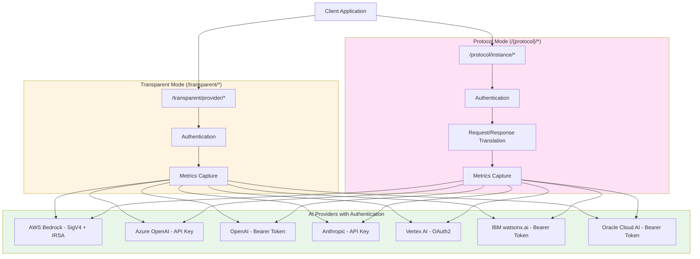

# Transparent and Protocol-Based Routing Modes

This document explains the dual-mode architecture supporting both transparent passthrough and protocol-based transformations.

---

## Overview

The AI Gateway supports two operational modes:

### 1. **Transparent Mode** (`/transparent/{provider}`)
- **Purpose**: Authentication-only passthrough
- **Behavior**: Adds authentication, captures metrics, but does NOT transform requests/responses
- **Use Case**: When you want to use native provider APIs with centralized auth/metrics

### 2. **Protocol Mode** (`/{protocol}/{instance}`)
- **Purpose**: Protocol-based API with request/response transformation
- **Behavior**: Translates between protocols (e.g., OpenAI ↔ Bedrock)
- **Use Case**: When you want unified API across multiple providers

---

## URL Patterns

### Transparent Mode

```
/transparent/{provider}/*
```

**Examples**:
- `/transparent/bedrock/model/anthropic.claude-3-sonnet/invoke` → Native Bedrock API
- `/transparent/azure/openai/deployments/gpt-4/chat/completions` → Native Azure API
- `/transparent/anthropic/v1/messages` → Native Anthropic API

### Protocol Mode

```
/{protocol}/{instance_name}/*
```

**Examples**:
- `/openai/bedrock_us1_openai/chat/completions` → Bedrock via OpenAI protocol (US East 1)
- `/openai/bedrock_eu1_openai/chat/completions` → Bedrock via OpenAI protocol (EU West 1)
- `/openai/anthropic/chat/completions` → Anthropic via OpenAI protocol
- `/openai/vertex/chat/completions` → Vertex AI via OpenAI protocol

---

## Configuration

Provider instances are configured in `configs/provider-instances.yaml`:

```yaml
instances:
  # Transparent mode example
  bedrock_transparent:
    type: bedrock
    mode: transparent
    region: us-east-1
    authentication:
      type: aws_sigv4
    endpoints:
      - path: /transparent/bedrock
        methods: [GET, POST]
    metrics:
      enabled: true

  # Protocol mode example
  bedrock_us1_openai:
    type: bedrock
    mode: protocol
    protocol: openai
    region: us-east-1
    authentication:
      type: aws_sigv4
    transformation:
      request_from: openai
      request_to: bedrock_converse
      response_from: bedrock_converse
      response_to: openai
    endpoints:
      - path: /openai/bedrock_us1_openai
        methods: [POST]
    metrics:
      enabled: true
```

---

## Instance Configuration

### Required Fields

| Field | Description | Example |
|-------|-------------|---------|
| `type` | Provider type | `bedrock`, `azure`, `openai`, `anthropic`, `vertex`, `ibm`, `oracle` |
| `mode` | Operation mode | `transparent` or `protocol` |
| `authentication` | Auth configuration | See below |
| `endpoints` | URL paths | List of endpoint configs |

### Optional Fields

| Field | Description | When Used |
|-------|-------------|-----------|
| `protocol` | Target protocol | Protocol mode only |
| `transformation` | Transformation config | Protocol mode only |
| `region` | AWS region | Bedrock instances |
| `endpoint` | Service endpoint | Azure, Oracle |
| `base_url` | API base URL | OpenAI, Anthropic, IBM |
| `project_id` | Project ID | Vertex AI, IBM |

---

## Authentication Types

### AWS SigV4 (Bedrock)

```yaml
authentication:
  type: aws_sigv4
  service: bedrock-runtime
  region: us-east-1
  # Credentials from environment or IAM role
```

### API Key

```yaml
authentication:
  type: api_key
  header: api-key  # or x-api-key
  key: ${AZURE_OPENAI_API_KEY}
```

### Bearer Token

```yaml
authentication:
  type: bearer_token
  token: ${OPENAI_API_KEY}
```

### GCP OAuth2

```yaml
authentication:
  type: gcp_oauth2
  token: ${GCP_ACCESS_TOKEN}
```

---

## Transformation Configuration

### Format

```yaml
transformation:
  request_from: openai              # Input protocol
  request_to: bedrock_converse      # Target provider format
  response_from: bedrock_converse   # Provider response format
  response_to: openai               # Output protocol
  options:
    default_max_tokens: 4096
```

### Supported Transformations

| From | To | Description |
|------|-----|-------------|
| `openai` | `bedrock_converse` | OpenAI → AWS Bedrock Converse API |
| `openai` | `anthropic_messages` | OpenAI → Anthropic Messages API |
| `openai` | `vertex_gemini` | OpenAI → Vertex AI Gemini |
| `openai` | `ibm_generation` | OpenAI → IBM watsonx.ai |
| `openai` | `oracle_cohere` | OpenAI → Oracle Cohere |
| `openai` | `openai` | Passthrough (no transformation) |

---

## Use Cases

### Use Case 1: Transparent Bedrock Proxy

**Goal**: Use Bedrock API directly but centralize authentication

**Configuration**:
```yaml
bedrock_transparent:
  type: bedrock
  mode: transparent
  region: us-east-1
  authentication:
    type: aws_sigv4
  endpoints:
    - path: /transparent/bedrock
```

**Usage**:
```bash
# Native Bedrock Converse API
curl -X POST http://gateway:8090/transparent/bedrock/model/anthropic.claude-3-sonnet/converse \
  -d '{
    "messages": [...],
    "inferenceConfig": {...}
  }'
```

**Benefits**:
- No code changes needed
- Centralized AWS authentication
- Metrics captured
- Original Bedrock API preserved

---

### Use Case 2: OpenAI-Compatible Multi-Region Bedrock

**Goal**: Use Claude via OpenAI SDK across multiple regions

**Configuration**:
```yaml
bedrock_us1_openai:
  type: bedrock
  mode: protocol
  protocol: openai
  region: us-east-1
  transformation:
    request_from: openai
    request_to: bedrock_converse
    response_from: bedrock_converse
    response_to: openai
  endpoints:
    - path: /openai/bedrock_us1

bedrock_eu1_openai:
  type: bedrock
  mode: protocol
  protocol: openai
  region: eu-west-1
  transformation:
    request_from: openai
    request_to: bedrock_converse
    response_from: bedrock_converse
    response_to: openai
  endpoints:
    - path: /openai/bedrock_eu1
```

**Usage**:
```python
from openai import OpenAI

# Use Claude in US East 1
client_us = OpenAI(base_url="http://gateway:8090/openai/bedrock_us1", api_key="not-needed")
response = client_us.chat.completions.create(
    model="claude-3-sonnet",
    messages=[{"role": "user", "content": "Hello"}]
)

# Use Claude in EU West 1
client_eu = OpenAI(base_url="http://gateway:8090/openai/bedrock_eu1", api_key="not-needed")
response = client_eu.chat.completions.create(
    model="claude-3-sonnet",
    messages=[{"role": "user", "content": "Bonjour"}]
)
```

**Benefits**:
- Same OpenAI SDK
- Different regions per endpoint
- Automatic transformation
- Centralized metrics per region

---

### Use Case 3: Mixed Mode (Transparent + Protocol)

**Goal**: Support both native and OpenAI-compatible access

**Configuration**: Both instances defined

**Usage**:
```bash
# Option 1: Native Bedrock API (transparent)
curl -X POST http://gateway:8090/transparent/bedrock/model/.../converse \
  -d '{"messages": [...], "inferenceConfig": {...}}'

# Option 2: OpenAI-compatible API (protocol)
curl -X POST http://gateway:8090/openai/bedrock_us1/chat/completions \
  -d '{"model": "claude-3-sonnet", "messages": [...]}'
```

**Benefits**:
- Flexibility for different clients
- Migration path (transparent → protocol)
- Same authentication and metrics

---

## Metrics

### Per-Instance Metrics

Each instance captures separate metrics:

```
http_requests_total{method="POST", status="200", provider="bedrock", mode="transparent", region="us-east-1"}
http_requests_total{method="POST", status="200", provider="bedrock", mode="protocol", protocol="openai", region="us-east-1"}
http_requests_total{method="POST", status="200", provider="bedrock", mode="protocol", protocol="openai", region="eu-west-1"}
```

This allows tracking:
- Which mode is used more
- Which regions get more traffic
- Performance differences between modes

---

## Architecture



**Transparent Mode**: No transformation, just authentication and metrics
**Protocol Mode**: With transformation - OpenAI to/from Provider Format

---

## Migration Path

### Phase 1: Start with Transparent
```yaml
bedrock_transparent:
  mode: transparent
  endpoints: [/transparent/bedrock]
```

### Phase 2: Add Protocol Alongside
```yaml
bedrock_transparent:
  mode: transparent
  endpoints: [/transparent/bedrock]

bedrock_us1_openai:
  mode: protocol
  protocol: openai
  endpoints: [/openai/bedrock]
```

### Phase 3: Migrate Clients
- Move clients to `/openai/bedrock` endpoints
- Keep `/transparent/bedrock` for legacy clients

### Phase 4: Deprecate Transparent (Optional)
- Remove transparent endpoints
- Full protocol-based architecture

---

## Configuration Examples

### Example 1: Multi-Region Bedrock

```yaml
instances:
  bedrock_us1_openai:
    type: bedrock
    mode: protocol
    protocol: openai
    region: us-east-1
    endpoints: [/openai/bedrock_us1]

  bedrock_eu1_openai:
    type: bedrock
    mode: protocol
    protocol: openai
    region: eu-west-1
    endpoints: [/openai/bedrock_eu1]

  bedrock_ap1_openai:
    type: bedrock
    mode: protocol
    protocol: openai
    region: ap-northeast-1
    endpoints: [/openai/bedrock_ap1]
```

### Example 2: Provider Comparison

```yaml
instances:
  # Compare Bedrock vs Anthropic Direct
  bedrock_openai:
    type: bedrock
    mode: protocol
    protocol: openai
    endpoints: [/openai/bedrock]

  anthropic_openai:
    type: anthropic
    mode: protocol
    protocol: openai
    endpoints: [/openai/anthropic]
```

Use same OpenAI code, just change base_url to compare providers!

---

## Best Practices

### 1. Use Transparent for Native APIs
If your code already uses provider-specific APIs, use transparent mode to add auth/metrics without code changes.

### 2. Use Protocol for Standardization
If you want a unified API across providers, use protocol mode.

### 3. Instance Naming Convention
```
{provider}_{region}_{protocol}
```
Examples:
- `bedrock_us1_openai`
- `bedrock_eu1_openai`
- `anthropic_openai`
- `vertex_us_openai`

### 4. Metrics Labels
Always include meaningful labels:
```yaml
metrics:
  labels:
    provider: bedrock
    mode: protocol
    protocol: openai
    region: us-east-1
    environment: production
```

### 5. Environment Variables
Use environment variables for secrets:
```yaml
authentication:
  key: ${PROVIDER_API_KEY}
```

---

## Testing

### Test Transparent Mode

```bash
# Bedrock transparent
curl -X POST http://localhost:8090/transparent/bedrock/model/anthropic.claude-3-sonnet/converse \
  -H 'Content-Type: application/json' \
  -d '{
    "messages": [{"role": "user", "content": [{"text": "Hello"}]}],
    "inferenceConfig": {"maxTokens": 100}
  }'
```

### Test Protocol Mode

```bash
# Bedrock via OpenAI protocol
curl -X POST http://localhost:8090/openai/bedrock_us1/chat/completions \
  -H 'Content-Type: application/json' \
  -d '{
    "model": "claude-3-sonnet",
    "messages": [{"role": "user", "content": "Hello"}],
    "max_tokens": 100
  }'
```

---

## Troubleshooting

### Instance Not Found

**Error**: `No provider instance configured for this path`

**Solution**: Check `provider-instances.yaml` has matching endpoint path

### Wrong Mode

**Error**: `This endpoint requires transparent mode`

**Solution**: Verify instance `mode` matches the endpoint type

### Transformation Failed

**Error**: `Failed to translate request`

**Solution**: Check transformation configuration matches provider requirements

### Provider Not Available

**Error**: `Provider bedrock not available`

**Solution**: Ensure provider is initialized with proper credentials

---

## Next Steps

1. **Load Configuration**: Implement config loader in server startup
2. **Register Handlers**: Wire transparent and protocol handlers
3. **Test Both Modes**: Verify with actual requests
4. **Add Metrics**: Confirm per-instance metrics working
5. **Document**: Update API documentation with new endpoints

---

## Implementation Status

- [x] Configuration schema designed
- [x] Config loader implemented
- [x] Transparent handler implemented
- [x] Protocol handler implemented
- [ ] Server integration (in progress)
- [ ] Testing
- [ ] Documentation updates

---

**See Also**:
- `configs/provider-instances.yaml` - Configuration file
- `internal/instance/config.go` - Config loader
- `internal/handlers/transparent_handler.go` - Transparent mode
- `internal/handlers/protocol_handler.go` - Protocol mode
